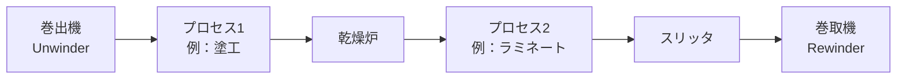
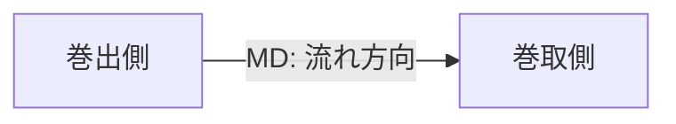

# ウェブハンドリングとは

## 概要

**ウェブ（web）** とは、フィルム・紙・金属箔・不織布・繊維シートなど、厚さに対して幅と長さが極端に大きい、連続した薄物材料の総称である。
**ウェブハンドリング（Web Handling）** は、これらのウェブをロールから巻き出し、各種工程（コーティング、印刷、ラミネート、乾燥、スリッタ、巻き取りなど）を経て、品質を保ったまま再びロールに巻き取るまでの一連の搬送・取り扱い技術をいう。

ロールトゥロール（Roll-to-Roll, R2R）生産方式の根幹をなす技術であり、フィルム製造、各種フィルムコンバーティング、製紙、金属箔圧延、リチウムイオン電池電極、有機EL、太陽電池、フレキシブルプリント基板など、現代の高機能材料製造に不可欠な共通基盤技術となっている。

## ウェブハンドリングの技術的課題

橋本『ウェブハンドリングの基礎理論と応用』第1章3節「ウェブハンドリングにおける技術的課題」では、ウェブハンドリングが対象とする技術領域を以下のように整理している。

- **ウェブの搬送**：張力、速度、蛇行の制御
- **ウェブの巻取・巻出**：内部応力、空気同伴、テレスコープ防止
- **ウェブの加工**：コーティング・印刷・ラミネートとの両立
- **トラブル予測・防止**：しわ、スリップ、断ウェブ

本サイトではこれらを以下の四つの技術領域として整理する。

| 領域 | 主な対象 | 関連ページ |
|------|----------|-----------|
| 張力制御 | ウェブ長手方向の張力を一定に保つ | [基本理論](../tension/theory.md) |
| ロール・搬送系の力学 | ロール周りの摩擦・ニップ・トルク | [ロール周りの力学](../roll/mechanics.md) |
| 蛇行制御 | ウェブ幅方向の位置制御 | [発生メカニズム](../steering/mechanism.md) |
| 巻取り | きれいなロール形状の形成 | （ロール周り参照） |

これらは相互に強く結合しており、たとえば張力が変動すれば蛇行や巻き不良が発生し、ロール表面の摩擦特性が変われば張力分布もしわも変化する。

## ウェブハンドリングが難しい理由

ウェブは「面内剛性は高いが、面外剛性はほぼゼロ」という極めて特殊な力学的性質をもつ。

- **薄い**：厚さ数 μm〜数百 μm。座屈・しわが極めて生じやすい。
- **柔らかい**：曲げ剛性 $D = E h^3 / 12(1-\nu^2)$ は厚さの三乗で効くため、厚さが半分になると曲げ剛性は 1/8 になる。
- **粘弾性的**：特にプラスチックフィルムは時間・温度依存の変形を示し、張力履歴が残る。
- **異方性**：MD（流れ方向）と TD（幅方向）で物性が異なる。
- **表面が敏感**：傷・スリキズ・ブロッキングが製品価値を直接損なう。

これらの理由から、ウェブの搬送には剛体機械力学だけでなく、薄板理論・摩擦力学・粘弾性・制御工学を横断する知識が要求される。

## 主な座標系と用語

| 略号 | 名称 | 意味 |
|------|------|------|
| MD | Machine Direction | ライン流れ方向（長手方向） |
| TD / CD | Transverse / Cross Direction | 幅方向 |
| ND | Normal Direction | 厚さ方向 |
| WIT | Web-In-Tension | 張力下のウェブ |
| span | スパン | 隣接する2本のロール間のウェブ区間 |
| nip | ニップ | 2本のロールが押し付け合う接触部 |

詳細は [用語・記号一覧](glossary.md) を参照。

## 本サイトの構成

| カテゴリ | 内容 |
|----------|------|
| [基礎知識](overview.md) | 概要、用語、材料特性 |
| [テンション制御](../tension/theory.md) | 張力理論、オイラー式、テンション分布、制御機器 |
| [ロール・搬送系の力学](../roll/mechanics.md) | ロール力学、ニップ、駆動系 |
| [蛇行制御](../steering/mechanism.md) | 蛇行メカニズム、ガイドロール、自動修正 |
| [トラブルシューティング](../trouble/wrinkle.md) | しわ、張力変動、蛇行への対策 |

## 参考文献

本サイトは以下を主たる参考書とする。

1. 橋本 巨『入門 ウェブハンドリング』加工技術研究会, 2010. — 全7章、ウェブハンドリング入門の定番。
2. 橋本 巨『ウェブハンドリングの基礎理論と応用』加工技術研究会. — 全10章、世界初のウェブハンドリング理論専門書。
3. ウェブハンドリング技術研究会編著『実践 ウェブハンドリング』加工技術研究会. — トラブル事例集と現場知見。
4. 『スリッター・リワインダーの技術読本』. — スリッタ・巻取機の現場技術解説。
5. D. R. Roisum, *The Mechanics of Web Handling*, TAPPI Press, 1996.
6. J. K. Good and D. R. Roisum, *Winding: Machines, Mechanics and Measurements*, DEStech, 2007.

### 本サイトと書籍の対応

| 本サイトのページ | 主な対応章 |
|------------------|-----------|
| [overview.md](overview.md) | 入門 第1章 / 基礎理論 第1章 |
| [glossary.md](glossary.md) | 入門 第3章 / 基礎理論 第2章 |
| [materials](material-film.md) | 入門 第3章 / 基礎理論 第2章2節 |
| [tension/theory.md](../tension/theory.md) | 入門 第6章 / 基礎理論 第8章 |
| [tension/euler.md](../tension/euler.md) | 入門 第4章 / 基礎理論 第2章4節 |
| [tension/distribution.md](../tension/distribution.md) | 基礎理論 第2章7節 |
| [roll/mechanics.md](../roll/mechanics.md) | 入門 第5章 / 基礎理論 第7章 |
| [roll/nip.md](../roll/nip.md) | 入門 第5章9節 / 基礎理論 第9章6節 |
| [steering](../steering/mechanism.md) | 入門 第7章 |
| [trouble/wrinkle.md](../trouble/wrinkle.md) | 入門 第3章 / 基礎理論 第6章 |
