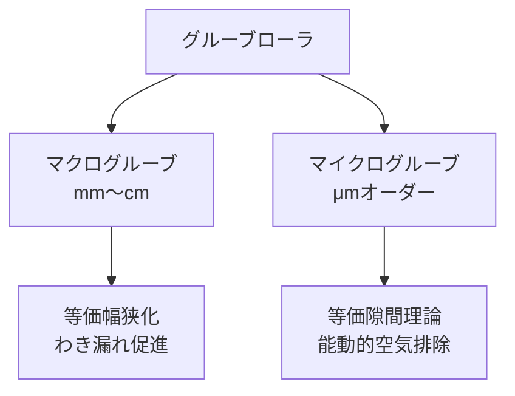
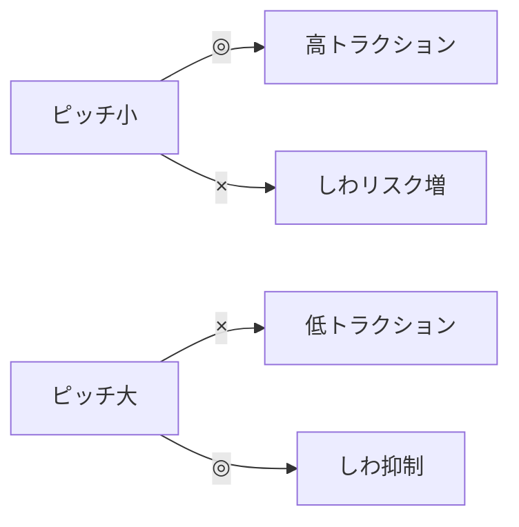
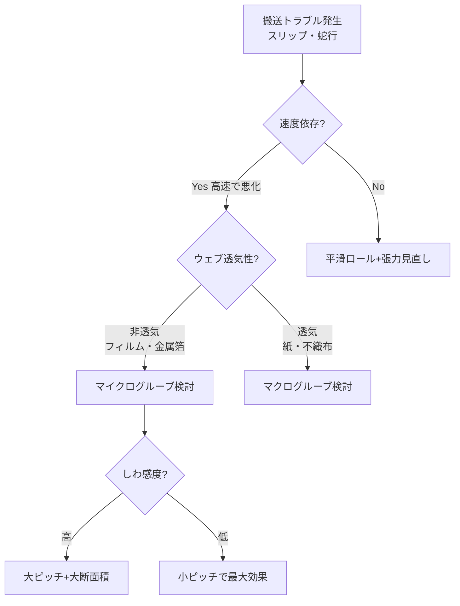

# マイクログルーブローラの理解と設計

**マイクログルーブローラ（micro-groove roller）** は、ローラ表面に **μm 〜 数百 μm オーダー** の微細な円周方向溝を加工したロールで、ウェブとローラ間に巻き込まれる空気膜を効果的に排除し、高速搬送下でもトラクションを確保するために用いられる。
本ページでは橋本『ウェブハンドリングの基礎理論と応用』第9章3節および疋田・橋本（日本機械学会論文集 2011）に基づき、原理・理論・設計指針・実機適用例を整理する。

## 1. なぜ必要か：高速搬送と空気同伴問題

ウェブ搬送速度を上げると、ロール表面とウェブの間に空気が同伴され、**有効摩擦係数 $\mu_\text{eff}$ が急減** する。
これは空気膜厚さ $h_0$ がロール・ウェブの合成粗さ $\sigma$ を超えると、混合潤滑状態 → 流体潤滑状態へと遷移し、トラクションが消滅するためである。

第3章で示される空気膜厚さの実験公式（橋本『基礎理論と応用』）：

$$
h_0 = 0.589\, R \left( \frac{6\eta U_w}{T/w} \right)^{2/3}
$$

ここで $R$ はロール半径、$\eta$ は空気粘度、$U_w$ はウェブ速度、$T/w$ は単位幅張力。
速度の 2/3 乗で空気膜厚さが増大するため、対策なしには高速化に限界がある。

??? question "演習: 高速化の限界"
    ロール径 $R = 50\,mm$、空気粘度 $\eta = 1.8 \times 10^{-5}\,Pa\cdot s$、単位幅張力 $T/w = 100\,N/m$、ウェブ速度 $U_w = 10\,m/s$ のとき、空気膜厚さ $h_0$ [μm] を求めよ。

    ??? success "解答"
        $h_0 = 0.589 \times 0.05 \times (6 \times 1.8 \times 10^{-5} \times 10/100)^{2/3}$
        $= 0.0295 \times (1.08 \times 10^{-5})^{2/3}$
        $= 0.0295 \times 4.94 \times 10^{-4} \approx 1.46 \times 10^{-5}\,m \approx 14.6\,\mu m$
        合成粗さ 1〜2 μm を大きく超えており、トラクションがほぼ消滅。グルーブ対策が必須。

## 2. グルーブローラの分類

橋本によりサイズで二分類されている。

| 種類 | グルーブサイズ | 原理 |
|------|---------------|------|
| **マクログルーブ**（macro-groove） | mm 〜 cm 単位 | 幅広ウェブを等価的に幅狭ウェブに分断し、わき漏れ流出を促進 |
| **マイクログルーブ**（micro-groove） | μm 単位 | グルーブ内のせん断流れで空気膜を能動的に排除 |

両者は **動作原理が根本的に異なる** ことに注意。マクログルーブが「巻き込まれた空気を端から逃がす」のに対し、マイクログルーブは「グルーブ自体を空気の通路として機能させる」。

非透気性ウェブ（プラスチックフィルム等）では **マイクログルーブが特に有効**。

??? question "演習: マクロとマイクロの違い"
    マクログルーブとマイクログルーブの **動作原理の違い** を一行で答えよ。

    ??? success "解答"
        **マクログルーブ**：幅広ウェブを等価的に幅狭ウェブに分断し、ウェブ端部からの **わき漏れ流出** を促進する。
        **マイクログルーブ**：グルーブ内の流れも空気潤滑膜として機能させ、**等価隙間の概念** で能動的に空気膜厚さを減らす。
        透気性ウェブにはマクロが、非透気性ウェブ（フィルム）にはマイクロが特に有効。

## 3. マイクログルーブの理論（橋本モデル）

### 3.1 等価隙間の概念

マイクログルーブローラを「平滑面ローラ＋等価隙間 $h_e$」に置き換えて解析する（橋本『基礎理論と応用』第9章3節 図9-7）。
グルーブ内の流れも空気潤滑膜として機能すると仮定し、巻き付き角領域では圧力勾配ゼロ・せん断流れ支配とする。

### 3.2 流量の保存

ウェブ幅 $w$、グルーブ数 $n_g$、グルーブ断面積 $S_g$ とすると、

平滑面相当の流量：

$$
q_x = \frac{U_w h_0}{2} \cdot w
$$

マイクログルーブローラの流量：

$$
q_x = \frac{U_w \tilde{h}}{2} \cdot w = \frac{U_w}{2}\left( h'_0 w + n_g S_g \right)
$$

流量保存条件から、実質的なウェブ浮上量 $h'_0$（ランド面とウェブの隙間）は：

$$
\boxed{\;h'_0 = \tilde{h} - \frac{n_g S_g}{w}\;}
$$

ここで $\tilde{h}$ はグルーブを平滑面に置き換えたときの隙間で、

$$
\tilde{h} = 0.589\, R \left( \frac{6\eta U_w}{T/w} \right)^{2/3}
$$

**もし $h'_0 < 0$ になればウェブはランド面に接触する**（$h'_0 = 0$ として扱う）。
すなわち、マイクログルーブの **断面積 $S_g$ とピッチ $b$（= $w/n_g$ 相当）の設計** によって、空気膜厚さを能動的に減らすことができる。

### 3.3 有効摩擦係数

ウェブとローラ間の有効摩擦係数 $\mu_\text{eff}$ は、第4章で定式化された粗さ突起接触理論から計算される。
$h'_0 / \sigma$（合成粗さに対する隙間比）が小さいほど、突起接触割合が増えて $\mu_\text{eff}$ が大きくなる。

??? question "演習: 実質浮上量の計算"
    幅 $w = 30\,mm$ のフィルムに、グルーブ数 $n_g = 12$、グルーブ断面積 $S_g = 0.01\,mm^2$ のマイクログルーブローラを使う。平滑面換算の隙間 $\tilde{h} = 5\,\mu m$ のとき、実質のウェブ浮上量 $h'_0$ [μm] を求めよ。

    ??? success "解答"
        $h'_0 = \tilde{h} - n_g S_g / w$
        $= 5 \times 10^{-6} - 12 \times 0.01 \times 10^{-6} / 0.03$
        $= 5 \times 10^{-6} - 4 \times 10^{-6} = 1 \times 10^{-6}\,m = 1\,\mu m$
        平滑面 5 μm → グルーブで 1 μm まで低減。合成粗さ程度なら接触状態が確保される。

## 4. 設計パラメータと効果

実機設計で扱う主要パラメータ：

| パラメータ | 記号 | 典型値 |
|-----------|------|--------|
| グルーブ断面形状 | — | 三角形、矩形、台形 |
| グルーブピッチ | $b$ | 0.5〜6 mm |
| グルーブ幅（底辺） | $b_g$ | 100〜250 μm |
| グルーブ深さ | $h_g$ | 50〜150 μm |
| グルーブ断面積 | $S_g$ | 0.005〜0.05 mm² |
| ロール径 | $R$ | 20〜100 mm（小径ほど効果大） |

**重要な設計上の知見**（橋本『基礎理論と応用』第9章3節 図9-9, 9-10, 9-11, 9-12）：

### 4.1 ピッチの影響

- **ピッチ $b$ を小さくする** → グルーブ数 $n_g$ 増 → スリップ開始速度上昇
- 同じ条件で、ピッチ 1.0 mm のローラはピッチ 5.0 mm に対しスリップ開始速度が **2〜3 倍** に向上する例あり

### 4.2 断面積の影響

- **グルーブ断面積 $S_g$ を大きくする** → 同じピッチでもスリップ開始速度上昇
- 形状（三角形・矩形・台形）は問わず、**ピッチと断面積が同じなら効果は等価**

### 4.3 張力との関係

- ウェブ張力 $T/w$ が大きいほど、グルーブの効果は顕著に現れる
- 低張力ウェブでは効果が限定的

??? question "演習: 形状の選択"
    マイクログルーブの形状を「三角形」「矩形」「台形」のどれにすべきか。

    ??? success "解答"
        **どれを選んでも、ピッチと断面積 $S_g$ が同じなら効果は同等**（橋本モデル）。
        実機では加工コスト・耐久性で決まる：旋削加工なら三角形が容易、エッチングなら矩形に近い、ローレットなら台形等。
        効果は形状でなく **「ピッチ× 断面積」で決まる** 点が設計のキー。

## 5. しわとのトレードオフ

マイクログルーブは**トラクション改善とは裏腹にしわを誘発しやすい**。

橋本『基礎理論と応用』第9章 図9-11 が示すように、

- グルーブピッチを小さくする → トラクション特性は改善
- 同時に **しわ発生臨界張力は低下** → しわが発生しやすい

これは、グルーブによる接触不連続が CD 圧縮応力を局在化させ、座屈条件を満たしやすくするため。

### 設計マップ（概念図）

設計は **動作速度域とウェブ厚さで決まる最適点** を狙うことになる。
ウェブが薄いほど（$h \le 25\,\mu m$）しわ発生臨界張力は急減するため、**薄物ウェブには大きめのピッチ＋大きめの断面積** が原則。

??? question "演習: 薄物ウェブの設計"
    厚さ 12 μm の PET フィルムにマイクログルーブローラを適用する。ピッチを「小さく詰める（1 mm）」「広めに取る（5 mm）」のどちらが適切か。

    ??? success "解答"
        **広めに取る（5 mm）**。
        薄物ウェブはしわ発生臨界張力が極めて低く、ピッチを詰めるとしわが頻発する。
        広めピッチで、足りないトラクションは断面積を大きくしてカバーする。または速度を抑える。

## 6. ロール表面処理の選択肢

実機ローラの選択肢：

| 種類 | 製法 | 特徴 |
|------|------|------|
| 旋削マイクログルーブ | 旋盤＋専用バイト | 形状自由度高、ロール径依存少 |
| ローレット加工 | 転造工具 | 量産安価、形状の柔軟性低 |
| エッチングローラ | 化学的・電解 | 微細パターン、粗面化 |
| ショットブラスト粗面 | ブラスト | 安価、サブミクロン粗さ |
| セラミック溶射 | 溶射＋研磨 | 高耐久、表面粗さ調整可 |
| 焼結金属 | 多孔質ロール | 自己排気、フィルム接触 |

マイクログルーブと粗面化（梨地、サテン仕上げ）は併用も可能。粗面のみでは効果が限定的なので、**高速ラインでは旋削マイクログルーブが第一選択** となる。

??? question "演習: ロール製法の選定"
    高速ライン（300 m/min 以上）で形状を最適化したいマイクログルーブローラの製法は？

    ??? success "解答"
        **旋削マイクログルーブ**。
        専用バイトで形状（ピッチ・断面積・角度）を自由に設計できる。試作・改造もしやすい。
        コスト重視ならローレット加工も候補だが、形状自由度は劣る。

## 7. 適用判断フロー

??? question "演習: 適用判断"
    新聞用紙（透気性大）の搬送ラインで高速時にスリップが多発している。マクログルーブとマイクログルーブのどちらを優先すべきか。

    ??? success "解答"
        **マクログルーブ**。
        紙のような透気性ウェブは、表面からの空気流出が容易なため、わき漏れ流出を促進するマクログルーブの効果が高い。
        マイクログルーブは非透気性ウェブ（フィルム・金属箔）向け。

## 8. 実機適用の注意点

### 8.1 グルーブの清掃

グルーブは塵・塗工剤・湿気で容易に目詰まりする。
- 定期的なエアブロー清掃
- 溶剤拭き取り（ロール表面材質と相性確認）
- 目詰まりすると平滑ロール化し、効果が突然失われる

### 8.2 ウェブとの相性

- **金属箔**：薄物（< 10 μm）はグルーブで微小エンボスを受ける可能性。形状を慎重に
- **塗工面接触**：塗工層をマイクログルーブが転写しないか確認
- **光学フィルム**：表面欠陥が問題になる場合は使用不可

### 8.3 ロール径との関係

空気膜厚さ式から分かるように、**$h_0$ はロール径 $R$ にほぼ比例** する。
小径ロールほど元々空気膜が薄いため、マイクログルーブの効果は **中〜大径ロールでより顕著**。

### 8.4 巻き付き角の確保

$\theta \ge 60°$ 程度を確保しないと、グルーブによる流量制御が十分機能しない。

??? question "演習: 目詰まり対策"
    マイクログルーブローラの効果が運転中に突然失われた。考えられる原因と対策は？

    ??? success "解答"
        **原因**：グルーブが塵・塗工剤・湿気で目詰まりして平滑ロール化した。
        **対策**：
        (1) 定期的なエアブロー清掃（運転中／停止時）
        (2) 溶剤拭き取り（材質と相性を確認）
        (3) 目詰まり前に清掃する予防保全スケジュール導入
        (4) 塗工剤の付着方向を変える、塗工後の距離を取る等

## 9. 設計手順（実用版）

1. **ラインの最高速度と最低張力** を確認
2. 平滑ロール想定で空気膜厚さ $h_0$ を計算
3. $h_0 > \sigma$（合成粗さ）なら空気同伴問題あり → グルーブ採用
4. ウェブが透気性ありなら **マクログルーブ**、非透気なら **マイクログルーブ**
5. ウェブ厚さからしわ発生臨界張力を確認、ピッチ上限を決定
6. 必要トラクション確保のため、ピッチを小さく／断面積を大きく
7. 試作ロールで搬送試験 → スリップ開始速度・しわ発生限界を実測
8. 必要に応じてピッチ・断面積を反復調整

??? question "演習: 設計手順"
    新規ラインの設計で最初にやるべきことは？

    ??? success "解答"
        **「ラインの最高速度と最低張力」を確認 → 平滑ロール想定で空気膜厚さ $h_0$ を計算**。
        この $h_0$ がウェブ・ロール合成粗さ $\sigma$ を超えていなければグルーブは不要。
        超えている場合のみ、グルーブの種類と仕様を検討する。
        最初から「グルーブにする」と決め打ちせず、本当に必要かを判断するのが設計の出発点。

## 10. 計算例

PET 25 μm フィルム、ロール径 $R = 55$ mm、巻き付き角 60°、張力 $T = 100$ N/m、ライン速度 $V = 5$ m/s の条件で：

**平滑ロール**：
$$
h_0 = 0.589 \times 0.055 \times \left( \frac{6 \times 1.8\times 10^{-5} \times 5}{100} \right)^{2/3} \approx 1.5\,\mu m
$$

合成粗さ $\sigma = 0.6$ μm 程度とすると、$h_0 > \sigma$ → スリップ発生領域。

**マイクログルーブ**（$b_g = 200$ μm、$h_g = 100$ μm、$S_g = 0.01$ mm²、ピッチ $b = 2.5$ mm、$n_g = w/b$）：
$h'_0 = \tilde{h} - n_g S_g / w$ で空気膜厚さを大幅減 → トラクション確保。

ピッチを 1 mm まで詰めるとさらに改善するが、しわ発生臨界張力との兼ね合いで設計。

??? question "演習: トレードオフ（しわ）"
    マイクログルーブのピッチを小さくすると、トラクションは改善する一方で、何が悪化するか？

    ??? success "解答"
        **しわ発生臨界張力が低下**（しわが出やすくなる）。
        グルーブによる接触不連続が CD 圧縮応力を局在化させ、座屈条件を満たしやすくするため（橋本『基礎理論と応用』第9章 図9-11）。
        薄物ウェブほど顕著で、ウェブ厚さに応じてピッチ上限を決める必要がある。

## 参考文献

- 橋本 巨『ウェブハンドリングの基礎理論と応用』第9章「ウェブハンドリング基礎理論の拡張」、特に9.2節「マクログルーブローラを用いた場合の理論」、9.3節「マイクログルーブローラを用いた場合の理論」, 加工技術研究会.
- 橋本 巨『ウェブハンドリングの基礎理論と応用』第3章「ウェブ浮上量の予測理論」, 第4章「有効摩擦係数の予測理論」（基礎となる空気膜厚さ・摩擦係数モデル）.
- 疋田伸治, 橋本 巨「マイクログルーブローラを用いた搬送中に生じるウェブのスリップとしわの改善」, 日本機械学会論文集 (C編), 2011.
- ウェブハンドリング技術研究会編著『実践 ウェブハンドリング』第2章「しわ・スリップ・搬送」, 加工技術研究会.
- 橋本 巨『入門 ウェブハンドリング』第4章「トライボロジー」（摩擦理論の基礎）.
