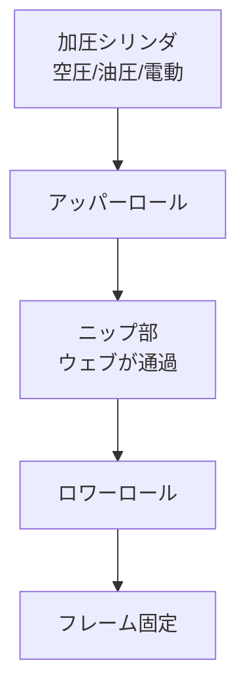

# ニップ力と変形

**ニップ（nip）** とは、2本のロールが互いに押し付け合い、その間にウェブを挟む構造をいう。
ライン中ではテンションカット、密着搬送、ラミネート、エア排除巻取、印刷転写など多用途で使われる。
ニップは「効果が大きいぶん副作用も大きい」装置で、選定と運用にはロール変形・ニップ圧分布・温度・摩擦の理解が不可欠。

## 1. ニップの用途

| 用途 | 目的 |
|------|------|
| テンションカット | 上下流の張力を分離（駆動分離） |
| ニップ駆動 | スリップなしの確実な搬送 |
| エア排除 | 巻取時の同伴空気を押し出す |
| ラミネート | 2枚以上のウェブを圧着 |
| 転写 | 印刷・コーティングの転写圧 |
| キャレンダ | 表面平滑化、厚さ調整 |

## 2. ニップロールの構造

- 上ロール（または片側）が可動、もう一方は固定。
- 加圧源：空圧（簡便、応答良）、油圧（高荷重）、電動シリンダ（精密）。
- 片側にロードセルを入れ、ニップ荷重を実測管理する場合が多い。

## 3. ニップ圧分布

### Hertz の弾性接触理論

弾性体ロール（金属ロール ＋ ゴムロール）どうしの接触は線接触で、ニップ幅 $2b$ と最大接触応力 $p_0$ は次式：

$$
b = \sqrt{\frac{4 F R^*}{\pi L E^*}}, \qquad p_0 = \sqrt{\frac{F E^*}{\pi L R^*}}
$$

ただし、

$$
\frac{1}{R^*} = \frac{1}{R_1} + \frac{1}{R_2}, \quad \frac{1}{E^*} = \frac{1 - \nu_1^2}{E_1} + \frac{1 - \nu_2^2}{E_2}
$$

ここで $F$ はニップ全荷重、$L$ はロール接触長、$R_1, R_2$ はロール半径、$E_i, \nu_i$ は各ロール材料の物性。
ゴムロールの場合は線形弾性体としては扱えず、有限要素解析（FEA）や Walowit などの近似式が用いられる。

### ニップ線荷重

実機では **線荷重** $w_l = F/L$ [N/m] または [N/cm] の単位で管理する。

| 用途 | 典型ニップ線荷重 |
|------|------------------|
| 軽ニップ（テンションカット） | 5〜30 N/cm |
| エア排除（巻取ライダ） | 10〜100 N/cm |
| ラミネート（軟質） | 30〜200 N/cm |
| カレンダ（紙、塩ビ） | 100〜2000 N/cm |
| スーパーカレンダ | 〜5000 N/cm |

設計はゴム硬度、ロール径、ウェブ厚みを総合して決める。

## 4. ゴム被覆ロールの変形

ニップ部のゴム層は局所的に圧縮・剪断され、温度上昇（自己発熱）と疲労が起こる。

### ゴム硬度の影響

| ゴム硬度 | ニップ幅（標準条件） | 用途 |
|---------|---------------------|------|
| Shore A 50（軟） | 広い | 段差吸収、シール |
| Shore A 70 | 中 | 標準ラミネート |
| Shore A 90 | 狭い | 高精度転写 |
| Shore D 60〜80 | 非常に狭い | プラスチックロール、超精密 |

軟質ゴムは追従性が良い反面、自己発熱と摩耗が大きい。硬質は摩耗・発熱が小さいが、段差・偏心への許容度が低い。

### クラウン補正

ニップ荷重でロールが両端支持の梁として撓むため、中央部のニップ圧が低下する。
これを補うために中央径を大きくする「クラウン」を付ける：

$$
\Delta R(x) = c \left[ 1 - \left(\frac{2x}{L}\right)^2 \right]
$$

ここで $c$ はクラウン量（中央部の半径増加）、$x$ は軸方向座標、$L$ はロール長。
クラウン量は荷重・温度・速度で最適値が変わるため、運転条件が変動するラインでは **可変クラウン（Swimming Roll、Nipco など）** を採用する。

## 5. ニップにおけるウェブ挙動

### ニップ通過時のウェブ変形

ニップを通るウェブには圧縮・剪断・引張が同時にかかり、

- 厚さ：可逆〜永久的に減少
- 表面粗さ：平滑化（カレンダ効果）
- 密度：圧密
- 残留応力：MD・TD ともに変化

特に塗工層付ウェブでは、ニップ圧が塗膜を変形させたり、ピンホール・気泡発生の原因となる。

### ニップでの駆動分離

ニップロールはオイラー式の制限を受けず、上下流で任意の張力差を維持できる。
ただし完全分離するには次の条件が必要：

$$
\mu_\text{nip} \cdot p \cdot A_c \ge T_\text{upper} - T_\text{lower}
$$

ニップ圧 $p$、接触面積 $A_c$、ニップ内摩擦係数 $\mu_\text{nip}$ が十分でないと、ニップ内でもウェブが滑る（ニップスリップ）。

### スリップとマイクロスリップ

- **巨視的スリップ**：ニップ全体でウェブが滑る。明確な異常。
- **マイクロスリップ**：ニップ入口側／出口側の局所滑り。常に少量発生し、ニップ印刷ムラやしわの原因。

橋本『入門 ウェブハンドリング』第4章では、巻き付き角を考慮したマクロスリップ条件と防止方法が詳述されている。

## 6. 巻取りでのニップ：エア排除

高速巻取りでは前述のとおりロール表面とウェブ間に空気膜が引き込まれ、ふくれ巻き（ソフトロール）の原因となる。
ライダロール（ニップロール）を巻取ロールに当てて空気を強制排出する。

巻取応力の Pfeiffer 式：

$$
\sigma_w = \frac{T_w}{w h} + \mu \cdot \frac{N}{w h}
$$

ニップ荷重 $N$ により、低い巻取張力 $T_w$ でも内部応力を確保できる。
ただしニップ圧が高すぎると、

- ウェブ表面に「ニップ跡」が残る
- 塗膜が押し変形
- 厚さプロファイルが転写されて巻きズレ

橋本『基礎理論と応用』第9.6節「ニップのある場合のウェブ巻取理論」では、ニップ併用時の巻取応力分布の数値解析が示されている。

## 7. ニップ設計チェックリスト

実機立上げ・改造時のチェック：

- [ ] 必要ニップ線荷重 $w_l$ [N/cm] と上限／下限
- [ ] CD 方向の荷重均一性（クラウン量、加圧シリンダ位置）
- [ ] ゴム硬度・厚さ・耐熱温度
- [ ] 自己発熱対策（冷却、断続運転）
- [ ] ロール変形を見越したクラウン
- [ ] 加圧解放速度（ニップ抜け、断ウェブ対応）
- [ ] ロードセル校正と過荷重センサ
- [ ] 安全カバー（ニップポイント挟まれ対策）
- [ ] メンテ：ゴム層の摩耗測定、再被覆周期

## 8. 故障モードと対策

| 故障 | 原因 | 対策 |
|------|------|------|
| ニップ跡 | 過荷重、クラウン不適 | 荷重低減、可変クラウン |
| 中央緩み | 撓み大、クラウン不足 | クラウン増、Swimming Roll |
| 端高ニップ | 過剰クラウン | クラウン減 |
| 縞模様 | ゴム偏摩耗、振動 | ゴム研磨、軸受点検 |
| ゴム剥離 | 過熱、せん断疲労 | 速度減、ゴム硬度見直し |
| 異常温度 | 連続高荷重 | 冷却、間欠運転、ゴム種変更 |

## 理解度チェック

??? question "演習1: ニップ線荷重"
    ロール接触長 $L = 1.2\,m$、必要なニップ全荷重 $F = 600\,N$ のとき、ニップ線荷重 $w_l$ [N/cm] を求めよ。
    また、これは「軽ニップ」「ラミネート」「カレンダ」のどのレンジに相当するか。

    ??? success "解答"
        $w_l = F/L = 600/1.2 = 500\,N/m = 5\,N/cm$
        → **軽ニップ（5〜30 N/cm）** のレンジ。テンションカット用などに該当。

??? question "演習2: ニップの駆動分離"
    ニップロールを使ってテンションゾーンを上下流で完全分離するための必要条件を答えよ。

    ??? success "解答"
        $\mu_\text{nip} \cdot p \cdot A_c \ge T_\text{upper} - T_\text{lower}$
        すなわち、ニップ内摩擦力（摩擦係数×圧力×接触面積）が、上下流の張力差以上であること。
        これを満たさないと「ニップスリップ」が起き、駆動分離が不完全になる。

??? question "演習3: 巻取とニップ"
    巻取張力 $T_w = 200\,N/m$ だけで巻くと軟巻きになる。ライダロールでニップ荷重 $N = 5000\,N/m$、層間摩擦係数 $\mu = 0.3$ を加えると、Pfeiffer 式による巻取応力 $\sigma_w$（単位幅）はどう変化するか。

    ??? success "解答"
        ニップなし：$\sigma_w \cdot wh = T_w = 200\,N/m$
        ニップあり：$\sigma_w \cdot wh = T_w + \mu N = 200 + 0.3 \times 5000 = 200 + 1500 = 1700\,N/m$
        → 約 **8.5 倍** に増加。低い巻取張力でも内部応力を確保でき、テレスコープ防止に有効。

## 参考文献

- 橋本 巨『入門 ウェブハンドリング』第4章, 第5章, 加工技術研究会, 2010.
- 橋本 巨『ウェブハンドリングの基礎理論と応用』第9章6節「ニップのある場合のウェブ巻取理論」, 加工技術研究会.
- 『スリッター・リワインダーの技術読本』第2章「巻取方式」, 第1章「ニップローラー」.
- J. K. Good, *Winding: Machines, Mechanics and Measurements*, DEStech, 2007.
- K. L. Johnson, *Contact Mechanics*, Cambridge Univ. Press, 1985.
