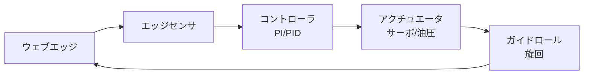

# 自動蛇行修正装置

ウェブの蛇行を **エッジセンサ → 制御 → ガイドロール旋回** の閉ループで自動補正する装置を、一般に **EPC（Edge Position Control）** または **CPC（Center Position Control）** と呼ぶ。
本ページでは EPC システムの構成、制御理論、選定指針を整理する。

## 1. システム構成

主要構成要素：

| 要素 | 機能 |
|------|------|
| エッジセンサ | ウェブエッジ位置を計測 |
| コントローラ | 偏差から指令を計算（PI/PID） |
| アクチュエータ | サーボ・油圧・電動シリンダ |
| ガイドロール | 旋回／並進してウェブを動かす |
| 機械フレーム | 高剛性、低バックラッシ |

## 2. エッジ検出方式

| 方式 | 原理 | 適用ウェブ | 精度 |
|------|------|-----------|------|
| 透過光（フォトCCD） | LED光をエッジで遮る量 | 不透明〜半透明 | ±0.1 mm |
| 反射光 | エッジ部の反射量変化 | 任意 | ±0.2 mm |
| 超音波 | 超音波のエッジ通過遮断 | 透明、多層 | ±0.2 mm |
| 渦流式 | 金属ウェブの誘導 | 金属箔 | ±0.05 mm |
| 静電容量 | 距離変化 | 金属、導電性 | ±0.1 mm |
| ラインスキャンカメラ | 画像処理でエッジ／パターン検出 | 任意（パターン認識可） | ±0.05 mm |

特殊な用途：

- **印刷見当検出（CPC）**：ウェブ上の印刷マークを画像で見て位置決め。
- **両エッジ検出（センターガイド）**：両エッジを検出して中央位置を維持。幅変動するウェブに有効。

## 3. ガイドロール機構

ロール（または複数ロール群）をどう動かすかで、修正動作の特性が変わる。

### (a) ピボット（旋回）方式

1本のロールフレームを、中央のピボット軸を中心に旋回。

- 構造シンプル、応答速い
- 修正量は ±数度 = ウェブの数十 mm

### (b) パラレル（平行移動）方式

ロール（または2本のロールフレーム）を平行に平行移動。

- 大型ウェブに有効
- ストローク確保しやすい

### (c) ステアリング方式

スパン入口側の傾きで下流ウェブを誘導。橋本『入門』第7章「直角方向進入性」の応用。

### (d) 巻出・巻取シフト方式

巻出・巻取機ごと軸方向にスライド。ロールが大きく動かせる利点があるが装置が大掛かり。

## 4. 制御理論

### スパン時定数

ウェブの蛇行応答は、スパン時定数 $\tau = L/V$ の 1 次遅れ系として近似される。

$$
G_p(s) = \frac{K_p}{\tau s + 1} e^{-T_d s}
$$

- $K_p$：ガイドロール傾き角に対するウェブ横変位の感度
- $\tau$：スパン時定数 $L/V$
- $T_d$：センサからガイドロールまでの遅れ

### PI コントローラ

EPC 制御は通常 PI で十分：

$$
u(s) = K_c \left(1 + \frac{1}{T_i s}\right) e(s)
$$

チューニング指針：

- $K_c$：オープンループゲイン $K_c K_p = 1\sim 3$ を目安
- $T_i$：スパン時定数の 2〜5 倍
- 微分は通常不要（ノイズに弱い）

### ループ周期

制御周期はスパン時定数の 1/10 以下が目安：

- 中速ライン（100 m/min, L=2 m）：$\tau = 1.2\,\text{s}$ → 制御周期 100 ms
- 高速ライン（500 m/min, L=2 m）：$\tau = 0.24\,\text{s}$ → 20 ms

### 速度依存ゲインスケジューリング

ライン速度が変動する場合、$\tau$ が変わるため固定ゲインでは性能劣化する。
**速度に応じてゲインを変更** するスケジューリングが標準的。

$$
K_c(V) = K_{c0} \cdot \frac{V_0}{V}
$$

## 5. 設置位置と修正範囲

### 設置位置

EPC は **修正したい工程の直前** に置くのが原則。

| 位置 | 目的 |
|------|------|
| 巻出直後 | 原反由来の蛇行吸収 |
| 塗工部直前 | 塗工幅安定 |
| 印刷部直前 | 見当精度確保 |
| ラミネート直前 | 重ね合わせ精度 |
| 巻取直前 | 巻取端面の揃え |

複数 EPC を直列に配置することも一般的。

### 検出位置とアクチュエータ位置の関係

エッジセンサは **ガイドロールよりも下流** に設置する（フィードバック制御のため）。
センサからガイドロールまでが近すぎると応答振動、遠すぎると遅れで応答遅延。

## 6. アクチュエータ選定

| 種類 | 推奨条件 |
|------|----------|
| ACサーボ + ボールねじ | 高精度、高応答、中容量。最も標準 |
| 電動シリンダ | コンパクト、メンテ少 |
| 油圧シリンダ | 大荷重、高速。配管要 |
| 空圧シリンダ + 比例弁 | 安価、応答中。剛性低 |
| ステッピングモータ | 低速、低価格、簡易系 |

応答時間：50〜200 ms が標準。

## 7. 実用上の注意点

### 振動と発振

- ガイドロールを過度に俊敏に動かすと、ウェブが「振り子状」に振動。
- 制御ゲインが高すぎる、または計測遅れが大きいと発振。
- 対策：ゲイン下げる、フィルタを入れる、機械剛性上げる。

### 端切れ・エッジ欠損

- ウェブエッジが欠けていたり、塗工はみ出しがあるとセンサ誤検出。
- 対策：両エッジ検出のセンターガイド、画像センサ、フィルタリング。

### スプライス（接紙）通過

- 接紙部はエッジが乱れる。一時的に制御ホールド。

### 透明ウェブ・無地ウェブ

- 透過光式が使えない場合は超音波・静電容量を使う。
- 画像センサは強力だがコスト・キャリブレーション要。

## 8. CPC（Center Position Control）と LPC（Line Position Control）

- **EPC**：エッジ位置を一定に保つ（ウェブ幅が一定なら中央も維持）
- **CPC**：両エッジ検出で中央位置を維持。ウェブ幅変動に強い
- **LPC**：印刷ラインや塗工エッジなど **任意の特徴線** を維持

選択指針：

| ウェブ条件 | 推奨 |
|-----------|------|
| 幅一定、エッジクリーン | EPC |
| 幅変動あり | CPC |
| エッジが汚い／印刷で位置決め必要 | LPC（カメラ式） |
| マルチレーン（スリッタ後） | エッジ＆中央併用 |

## 9. メーカ・選定の現状

- **Maxcess（Fife）**：世界最大手、ガイドロール全機種
- **Erhardt+Leimer（独）**：高精度、欧州規格中心
- **Nireco**：日本国内大手、加工技研系
- **BST eltromat**：印刷分野強い
- **Maxcess MAGPOWR**：トルク制御も一体提案

セルベンダの場合は、メーカ標準ソフトウェアと PLC（三菱、安川、Siemens 等）との通信プロトコル（EtherCAT、Modbus TCP、CC-Link 等）を確認。

## 10. EPC 導入チェックリスト

- [ ] 蛇行量（センターからの偏差）、修正必要範囲は？
- [ ] ライン速度範囲（最低速 — 最高速）
- [ ] ウェブ材質・幅・厚さ・透明度
- [ ] エッジ品質（綺麗 / バリ / ジグザグ）
- [ ] スパン長と巻き付き角の確保
- [ ] 必要応答性（蛇行外乱の周波数）
- [ ] スパースペース、装置設置寸法
- [ ] 既存 PLC・通信プロトコル
- [ ] 安全設計（カバー、非常停止連動）

## 参考文献

- 橋本 巨『入門 ウェブハンドリング』第7章, 加工技術研究会, 2010.
- 各メーカ技術資料：Maxcess（Fife/MAGPOWR）, Erhardt+Leimer, Nireco, BST eltromat 等.
- D. R. Roisum, *The Mechanics of Web Handling*, TAPPI Press, 1996, Ch. 4.
- J. J. Shelton, "Lateral Dynamics of a Moving Web", PhD thesis, Oklahoma State Univ., 1968.
