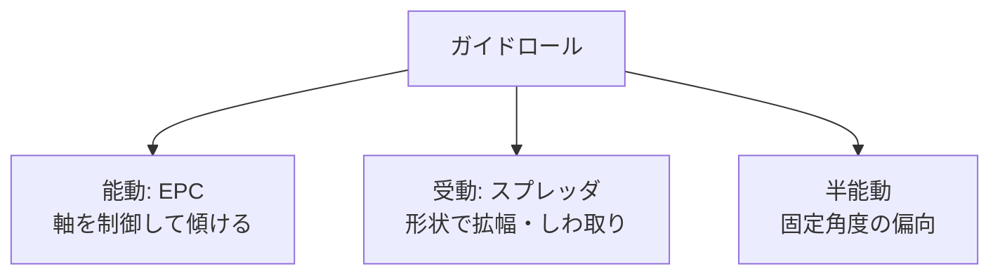
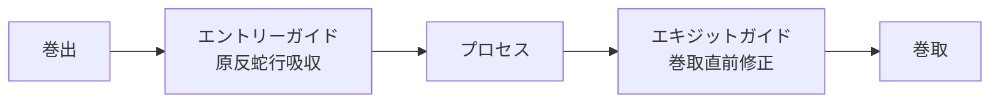

# ガイドロールの設計

蛇行を**機械的に**修正・抑止するロール群を、本サイトでは広く「ガイドロール」と呼ぶ。
能動的に傾けて修正する **EPC ガイドロール**（自動制御は [自動蛇行修正装置](auto-guide.md)）、受動的に拡幅する **スプレッダロール**、両者の中間に位置する各種ロールがある。

## 1. ガイドロールの分類

機能別に整理：

| 用途 | 代表ロール | 主目的 |
|------|-----------|--------|
| 拡幅・しわ取り | バナナロール、コンケーブ、スパイラル溝 | CDに広げる |
| 分離 | テーパロール、フリースプレッダ | スリット後のウェブ分離 |
| 蛇行修正 | EPC ガイドロール（ピボット型／パラレル型） | 位置補正 |
| 接触安定化 | 真空ロール、ニップロール | 滑り抑止 |

## 2. 拡幅（スプレッダ）ロール各種

『スリッター・リワインダーの技術読本』第1章 3.4「ウェブの幅拡げ」では、以下が体系的に紹介されている。

### (a) 凹面ローラー（Concave Spreader Roller）

中央が細く、両端が太い樽形ロール。両端側へウェブを引く効果。
構造シンプル、保守容易だが、効果はマイルド。

### (b) エキスパンダーローラー（Bowed Spreader Roller、バナナロール）

ゴム筒の中に湾曲した軸を通し、ロール全体を「弓なり」にしたもの。
ウェブが弓の凸側を通ると、軸方向に外側へ広げられる。

- 曲率（湾曲量）：通常 10〜30 mm/m
- ゴム硬度：A50〜A70 が標準
- 巻き付き角：90°前後で最も効果
- 設置位置：弓の凸側がウェブ進入方向に向く

最も汎用的な拡幅ロール。一方で **回転抵抗** が大きく、ウェブを滑らせやすいので低張力ウェブでは要注意。

### (c) スプレッダバー（Bent Pipe / D-Bar）

回転しない曲がりパイプ／D 字断面バー。空気層を作って摩擦低減し、しわ取り。
低速・薄物に。回転抵抗ゼロ。

### (d) 2本曲がりローラー（Dual Bowed Roller Spreader）

バナナロールを2本連続。より強力な拡幅。

### (e) POS-Z スプレッダ

両端のラッパ状曲面で拡幅。特殊用途。

### (f) スラットエキスパンダーローラー（Slatted Expander Roller）

軸方向のスラット（板片）が傾斜していて、回転に伴って軸方向力を発生。

### (g) 耳張りニップローラー（Edge Pull Web Stretchers）

ウェブ両エッジに小ニップを当て、外向きに引っ張る。テンター原理の小型版。

### (h) テンター（The Tenter）

クリップやピンで両端を掴み、機械的に幅方向に引っ張る大型装置。
フィルム製膜（TD延伸）の標準装置。

### (i) フリースプレッダ（The Free Spreader）

自由回転する湾曲ロール。バナナロールに近いが受動的。

### (j) 順応カバーローラー（Compliant Cover Roller）

軟質ゴム表面の摩擦で拡幅。

### (k) スパイラル溝付きローラー

ロール表面に螺旋状の溝を切り、回転時に軸方向の摩擦成分を作る。
**最も簡便で安価**、保守も楽。中速〜高速に多用。

## 3. 拡幅ロールの選定マトリクス

| ウェブ特性 | 推奨 |
|-----------|------|
| 薄物フィルム（PET 12 μm 等） | バナナロール、スパイラル溝 |
| 厚物フィルム | バナナロール（大曲率） |
| 紙、不織布 | コンケーブ、スパイラル溝 |
| 金属箔 | バナナロール（軟質ゴム）、スパイラル溝 |
| 塗工直後（表面接触NG） | エアタンクスプレッダ、テンター |
| 高速（>300 m/min） | バナナロール（高速対応軸受） |

## 4. EPC ガイドロール（蛇行修正ロール）

蛇行を能動的に修正するためのロール構造。詳細は [自動蛇行修正装置](auto-guide.md) を参照。

### 形式分類

| 形式 | 構造 | 特徴 |
|------|------|------|
| ピボット型（Pivot Guide） | 1本のロールを軸の中央で旋回 | 構造シンプル、コンパクト |
| パラレル型（Parallel Shifter） | 2本以上のロールフレームを平行移動 | 大型ウェブ、高精度 |
| ステアリング型（Steering Guide） | 旋回軸が前後方向 | 入口・出口の蛇行を独立制御 |
| エンドポジション型（End-Position Guide） | フレーム全体をリニア移動 | 巻出・巻取直結 |

旋回中心の位置や回転軸の方向によって、上流／下流どちらのウェブ姿勢を制御するかが変わる。

## 5. ガイドロール設計の基本式

### 入口・出口の蛇行関係

スパン長 $L$、ガイドロールの傾き角 $\phi$ のとき、ウェブの横変位 $y$ の応答は近似的に：

$$
\tau \frac{dy}{dt} + y = L \phi + y_0, \quad \tau = \frac{L}{V}
$$

すなわち、**スパン時定数** $\tau = L/V$ で 1 次遅れ系として応答する。

- 時定数小さく（速度高、スパン短）→ 応答速い、過敏
- 時定数大きく（速度低、スパン長）→ 応答遅い、安定

EPC 制御系のチューニングはこの時定数を出発点とする。

### 巻き付き角と修正効果

ガイドロールの巻き付き角 $\theta_w$ が小さいと、ロールを傾けてもウェブを動かす効果が弱い。
標準は $\theta_w \ge 90°$、できれば 120°以上を確保したい。

## 6. 設置位置の指針

- 蛇行を直したい工程の **直前** に置く（塗工直前、印刷直前、巻取直前など）
- ガイドロールから検出センサまでの距離は短く
- ガイドロールの旋回軸位置は、影響を与えたい上流／下流に応じて選ぶ
- 装置の入口側（巻出直後）にも置くと、原反由来の蛇行を吸収できる

## 7. メンテナンスと注意点

- ロール表面：擦り傷・打痕は即蛇行原因に。定期点検
- 軸受：自由回転確保、潤滑管理
- 平行度：定期的にレベル測定
- バナナロール：曲率設定（取付向きの誤りで逆効果に）
- スパイラル溝：溝目詰まりの清掃

## 8. ガイドロール選定チェックリスト

- [ ] 蛇行修正したい位置はライン内のどこか
- [ ] ウェブ材質・厚さ・幅・速度範囲は
- [ ] 必要な修正量（蛇行幅）と精度は
- [ ] 巻き付き角を 90° 以上確保できるか
- [ ] 拡幅か蛇行修正か、両方か
- [ ] スペース（旋回幅）の制約
- [ ] 既存制御系（PLC、HMI）との接続

## 参考文献

- 『スリッター・リワインダーの技術読本』第1章 3.4「ウェブの幅拡げ」, 3.2「回転ローラー」.
- 橋本 巨『入門 ウェブハンドリング』第7章, 加工技術研究会, 2010.
- 各メーカ製品資料：Maxcess（Fife）, Erhardt+Leimer, Nireco, BST 等.
