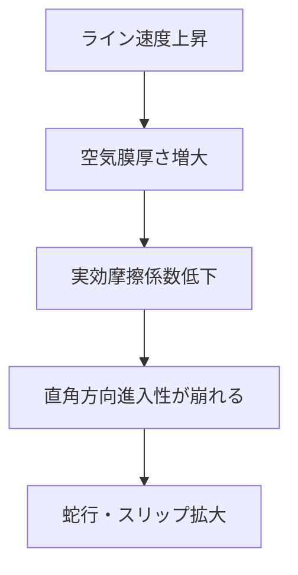

# 蛇行の発生メカニズム

ウェブが幅方向（CD）に位置ずれする現象を **蛇行（wandering / lateral motion）** という。
蛇行はそれ自体が直接の欠陥（巻取段ズレ、印刷見当ずれ、塗工幅不良など）であるだけでなく、しわ・破断の前駆現象でもある。
本ページでは蛇行を支配する物理原理と、発生メカニズムを体系的に整理する。

## 1. 蛇行を支配する基本原理：ウェブの直角方向進入性

橋本『入門 ウェブハンドリング』第7章で詳述されている、**ウェブハンドリング理論の最重要原理**：

!!! note "ウェブの直角方向進入性（normal entry rule）"
    搬送中のウェブでは、ウェブとローラ間の摩擦力が十分な大きさを保持しながら搬送されている限り、ウェブは **下流側のローラ軸に対して直角方向に進入する**。

つまりウェブは「次のロールに対して垂直に入りたがる」。この性質は、Shelton（1968）以来の蛇行解析の出発点となっている。

### 直角方向進入性の系

直角方向進入性から、次の現象が必然的に導かれる。

| 状況 | ウェブの挙動 |
|------|--------------|
| (a) 上下流ロール完全平行 | ウェブはまっすぐ進む |
| (b) 下流ロールにミスアライメント | ウェブは下流ロール軸に直角になるよう傾き、CD方向に移動（蛇行） |
| (c) 下流ロールがテーパ（径不均一） | ウェブは径の大きい方へ移動 |
| (d) 既に蛇行しているウェブ | 平行に戻すと、自然に元の位置へ復元する |

橋本『入門』第7章 図7-1・7-2 にこれらが図示・実験的に示されている。

## 2. 蛇行の発生原因（実機での主因）

### (a) ロールミスアライメント

最も多い原因。

- ロール軸の水平・垂直方向のズレ（平行度不良）
- ロール固定金具のガタ
- フレーム経年変形
- ロール撓み（自重・張力）
- 熱膨張による相対位置変化

数 0.1 mm/m のミスアライメントでも、長スパンでは数 mm の蛇行になる。

### (b) ウェブ自体の不整

- 厚さ分布の左右差（バギング）
- 物性の幅方向ムラ
- 熱収縮量の左右差
- 残留応力分布

製造工程で「片伸び（バギー）」のあるウェブは、いくら装置が完璧でも蛇行する。

### (c) 張力分布の片寄り

CD 張力分布に片寄りがあると、強い側へウェブが引かれる（[テンション分布](../tension/distribution.md) 参照）。

### (d) 速度・トルク変動

加減速時、巻取径変化、駆動同期ズレなどで瞬時的に左右非対称な力が発生。

### (e) 環境変動

- 乾燥炉内の温度ムラ
- 局所気流（吹き出しダクトの乱れ）
- 部分加湿／除湿

## 3. 蛇行を生む3種類の横方向作用

橋本『入門』第7章 図7-3 では、ウェブを CD方向に動かす力を3つに分類している。

| 種類 | メカニズム |
|------|-----------|
| (a) 横方向力 | CD方向に直接働く力。温度・湿度差による収縮差など |
| (b) 曲げモーメント | MD張力分布の左右差から生じるモーメント |
| (c) フォールディング | オフセット（ウェブ中心とロール中心の食い違い）による折り返し効果 |

実機の蛇行は通常、これら3つが複合して現れる。

## 4. Shelton モデル：蛇行の運動方程式

Shelton（1968）はウェブを **長スパンの梁** とみなし、スパンの両端での横変位 $y$ と傾き $\theta$ の挙動を支配方程式化した。

スパン入口での横変位 $y_1$、傾き $\theta_1$、出口の横変位 $y_2$ が与えられたとき、直角方向進入条件（ウェブが下流ロールに垂直に入る）から：

$$
\frac{1}{V}\frac{d y_2}{d t} = \theta_1 - \frac{y_2 - y_1}{L} + (\text{ロール傾き等の外乱項})
$$

ここで $V$ は搬送速度、$L$ はスパン長。

この式から：

- **スパンが長いほど** ウェブの横運動の時定数 $\tau = L/V$ が大きくなり、応答が遅い。
- **速度が高い** ほど時定数が短くなり、敏感に反応する。
- ロールの傾きは、下流のウェブ姿勢に直接効く。

## 5. 蛇行の伝播

「下流ロールの傾き」が上流の蛇行を作るが、その効果は **複数のスパンを上流に遡って** 伝わる。
これは Shelton の解析で示された、ウェブハンドリング技術者にとって反直感的だが重要な事実：

- ロール傾きの影響は、**そのロールより下流ではなく、上流のウェブ姿勢に現れる**
- すなわち、蛇行原因を探す際は、蛇行が観察される位置から **下流側** にも目を向ける必要がある

## 6. 蛇行と摩擦・空気同伴

ウェブとロール間の摩擦が不十分だと、直角方向進入性そのものが成立しない（ウェブがロール上を滑ってしまう）。
高速になると空気同伴で実効摩擦係数が低下し、蛇行が **急に大きくなる** ことがある。

対策：

- 溝付きロール、真空ロール、ニップでメカニカル拘束
- 駆動分離を増やす
- 速度に応じた張力プロファイル設定

## 7. 蛇行の周波数特性

蛇行は単発現象ではなく、しばしば特定周波数で振動的に発生する：

- **DC成分**：定常的なオフセット（恒久ミスアライメント）
- **巻取／巻出周期**：1 巻ピッチで現れる成分。バギング、ロール偏心
- **ロール回転周期**：ロール偏心、軸受不良
- **低周波振動**：制御ループの位相遅れによる自励振動
- **高周波**：通常はゼロ。ライン振動の影響

蛇行センサと FFT 解析で原因切り分けが効率的。

## 8. 蛇行測定方法

| 方法 | 原理 | 適用 |
|------|------|------|
| エッジセンサ（透過光） | ウェブエッジで光が遮られる量 | 標準、半透明・不透明ウェブ |
| 超音波エッジセンサ | 超音波の遮断 | 透明ウェブ |
| ラインスキャンカメラ | 画像でエッジ検出 | 任意のウェブ、印刷物 |
| 静電容量センサ | 距離変化 | 金属箔 |
| 渦流センサ | 金属ウェブ | アルミ・銅箔 |

精度は ±0.1 mm 程度が標準、高精度品は ±0.01 mm。

## 9. 対策概論

蛇行対策の全体像：

| 対策 | 内容 | 参照 |
|------|------|------|
| 装置精度管理 | ロール平行度・真直度の維持 | — |
| 駆動側 | テンションゾーン分離、左右独立張力管理 | [張力分布](../tension/distribution.md) |
| 専用機 | ガイドロール、エッジガイド | [ガイドロールの設計](guide-roll.md) |
| 自動制御 | EPC、CPC | [自動蛇行修正装置](auto-guide.md) |
| 拡幅ロール | バナナロール、スパイラル溝 | [ガイドロールの設計](guide-roll.md) |
| トラブル対応 | 原因切り分けと是正 | [蛇行トラブルの対策](../trouble/steering.md) |

## 理解度チェック

??? question "演習1: 直角方向進入性"
    上流側ロールに対し、下流側ロールがミスアライメントを持つとき、ウェブはどのように振る舞うか。

    ??? success "解答"
        ウェブは **下流側ローラの軸に対して直角方向に進入** しようとする（normal entry rule）。
        その結果、下流ローラの傾きの方向にウェブの中心線が傾き、**CD方向に蛇行が発生** する。
        さらに大きなミスアラインメントでは、ローラ手前で CD 圧縮応力が誘起され、折れしわの原因にもなる。

??? question "演習2: スパン時定数"
    スパン長 $L = 3\,m$、搬送速度 $V = 150\,m/min$ のとき、蛇行応答のスパン時定数 $\tau$ [s] を求めよ。

    ??? success "解答"
        $V = 150/60 = 2.5\,m/s$
        $\tau = L/V = 3/2.5 = 1.2\,s$
        この時定数より速い蛇行制御は応答が追いつかず発振しやすい。EPC のループ周期は 0.1 s 程度（時定数の 1/10）に設定するのが目安。

??? question "演習3: 蛇行原因の伝播"
    ライン中央のあるロールに片寄り蛇行が観察された。原因のロールは「観察位置の上流側」「下流側」どちらにあるか。

    ??? success "解答"
        **両方の可能性がある（むしろ下流側が見落とされやすい）**。
        Shelton 解析が示すとおり、「下流ロールの傾きが上流のウェブ姿勢に現れる」ため、観察された蛇行位置より下流側のロールも疑う必要がある。
        実機トラブル切り分けでは、観察位置の前後 2〜3 スパンを点検するのが鉄則。

## 参考文献

- 橋本 巨『入門 ウェブハンドリング』第7章「ローラによるウェブの分離・拡張メカニズム」, 加工技術研究会, 2010.
- 橋本 巨『ウェブハンドリングの基礎理論と応用』第2章7節「ウェブのトラッキング能力」.
- J. J. Shelton, "Lateral Dynamics of a Moving Web", PhD thesis, Oklahoma State Univ., 1968.
- J. J. Shelton, K. N. Reid, "Lateral Dynamics of an Idealized Moving Web", *ASME J. Dyn. Sys. Meas. Control*, 1971.
- D. R. Roisum, *The Mechanics of Web Handling*, TAPPI Press, 1996, Ch. 4.
