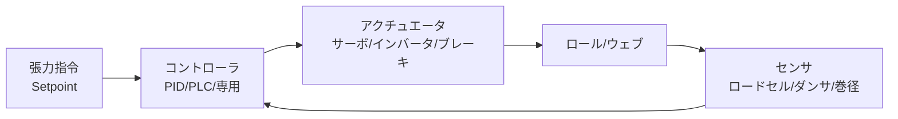

# 制御機器の選定

張力制御は理論だけでは閉じない。実機で目標性能を出すには **適切なセンサ・アクチュエータ・ロジック** の組み合わせが必要となる。本ページでは現場でよく使われる制御機器の選定指針を整理する。

## 1. システム構成の全体像

選定の順序は **目標性能 → センサ → アクチュエータ → コントローラ → チューニング**。

## 2. テンションセンサ

### (a) ロードセル方式

ロールの軸受け部分にひずみゲージ式または磁気式ロードセルを組み込み、ロールにかかる合力からウェブ張力を算出。

- **長所**：絶対値直読、応答速い、メンテ性良。
- **短所**：ロール自重補正、温度ドリフト補正が必要。

選定ポイント：

| 項目 | 推奨 |
|------|------|
| 容量 | 想定最大張力の 1.5〜3倍 |
| 過負荷耐性 | 150% 以上 |
| 出力 | mV/V または 4-20 mA |
| 取付角 | ウェブ巻き付き角の二等分線方向 |
| 左右独立 | CD 分布計測したい場合は必須 |

### (b) ダンサロール方式

ダンサ位置自体が張力を間接的に表す。位置をリニアエンコーダ／ポテンショメータで計測。

- 機械的低域フィルタとして働く。
- 高速かつ平均化された張力管理に向く。
- 慣性のため高周波の張力変動は捕捉できない。

### (c) 非接触式

レーザドップラー、画像解析による振動数計測など。
研究・診断用途、または接触を嫌う製品（光学フィルム、塗工直後）に。

## 3. アクチュエータ

### (a) ACサーボモータ

巻出・巻取・ドライブロールの主流。

- トルク・速度・位置の高精度制御。
- 最近は中容量（数 kW）でも応答 1 kHz 以上。
- インクリメンタル／アブソリュートエンコーダ内蔵。

### (b) インダクションモータ＋インバータ

コスト重視のライン、大容量（数十 kW 以上）で有利。

- ベクトル制御インバータでサーボに近い性能。
- ゼロ速トルクが必要なら **エンコーダFBベクトル制御** 必須。

### (c) パウダブレーキ／クラッチ

巻出側で低コスト張力発生用。

- 励磁電流でトルクを連続調整。
- 摩擦熱で連続発熱、放熱設計が必要。
- 加減速応答は遅い（〜100 ms）。

### (d) ヒステリシスブレーキ／磁気粒子ブレーキ

ノンスリップ、低発熱、長寿命。小〜中容量で精密用途に。

### (e) 空圧シリンダ／電動シリンダ（ダンサ）

ダンサロールに一定荷重を与える。

- 空圧：構造シンプル、力一定が容易。脈動・気密管理が必要。
- 電動：応答性高、位置同時制御可。コスト高。

### 選定マトリクス

| ゾーン | 推奨アクチュエータ |
|--------|--------------------|
| 巻出（小〜中） | パウダブレーキ または ACサーボ |
| 巻出（大） | ACサーボ または ベクトル制御モータ |
| 中間ドライブ | ACサーボ または ベクトル制御モータ |
| 巻取 | ACサーボ（テーパ制御要） |
| ダンサ | 空圧シリンダ（or 電動） |

## 4. コントローラ

### (a) 専用テンションコントローラ

メーカ製の「テンション制御専用機」。ロードセル入力・アナログ出力を一台で完結。

- 短期立上げ、低コスト。
- 巻径演算、テーパテンション、PID自動チューニング内蔵。
- 例：三菱、横河、Maxcess、Montalvo、Nireco 等。

### (b) PLC + サーボアンプ

ライン全体を統括する場合の標準構成。

- ラダー／構造化テキストでカスタム制御を組める。
- EtherCAT / Mechatrolink / SERCOS で多軸同期。
- 安全機能（STO, SS1）を統合可。

### (c) PCベース制御

研究用途、または超高速・高精度（μs オーダー）が必要な場合。

- LabVIEW RT、CompactRIO、Beckhoff TwinCAT など。
- カスタムアルゴリズム（H∞、MPC、Sliding Mode）の実装が容易。

## 5. チューニング指針

### PID パラメータの初期値

スパン剛性 $K = E w h / L$、巻取／駆動慣性 $J$、目標応答 $\omega_n$ を用いて、

$$
K_p \approx \frac{2 \zeta \omega_n J}{K}, \quad T_i \approx \frac{2 \zeta}{\omega_n}, \quad T_d \approx 0
$$

$\zeta = 0.7$、$\omega_n$ はスパン固有振動数の 1/3〜1/5 で開始。

### 順序

1. **積分のみ**（or 弱比例）で安定動作確認。
2. **比例ゲイン**を上げて応答を速くする。発振直前で 50% 戻す。
3. **微分**は通常不要、ノイズに弱い。
4. **巻径補正のフィードフォワード** を入れる（巻取／巻出）。
5. **加減速フィードフォワード**（慣性トルク補償）を入れる。

### 巻径推定

$$
R(t) = R_0 + \frac{V \cdot h \cdot t}{2\pi R(t)} \;\Longleftrightarrow\; R = \sqrt{R_0^2 + \frac{V h t}{\pi}}
$$

または超音波／光センサ／LVDT による直接計測。

## 6. 安全設計

- **断ウェブ検出**：張力急減を検知し、即時停止。
- **過張力検出**：張力上限超過で警告／停止。
- **エマージェンシストップ**：カテゴリ1停止以上。
- **アキュムレータ位置リミット**：満杯・空のメカリミット。
- **ロール温度監視**：パウダブレーキの過熱保護。

## 7. 選定チェックリスト

実機選定時のチェック項目：

- [ ] 最大張力、最小張力、ターンダウン比は？
- [ ] ライン最高速度、最大加速度、最大減速度は？
- [ ] 最大ロール径、最小（コア）径、最大重量は？
- [ ] 必要な応答性（バンド幅）は？
- [ ] 安全性能（PLd, SIL）の要求は？
- [ ] 通信プロトコルは？（EtherCAT, PROFINET, EtherNet/IP）
- [ ] エンジニアリングツールの社内資産は？

## 参考文献

- 橋本 巨『入門 ウェブハンドリング』第6章「ウェブの張力制御」, 加工技術研究会, 2010.
- 橋本 巨『ウェブハンドリングの基礎理論と応用』第8章「ウェブ搬送・巻取時の張力制御」（8.1 はじめに、8.2 ウェブ搬送システムと張力制御、8.3 張力制御のための力学系のモデリング、8.4 ウェブの張力制御系、8.5 PID コントローラの基本事項、8.6 PID のウェブ張力制御系への適用）, 加工技術研究会.
- 『スリッター・リワインダーの技術読本』第1章 6節「フリクション」、7節「力、動力」.
- 各メーカカタログ：三菱電機、安川電機、横河電機、Maxcess（Fife/Tidland/Magpowr）等.
- D. R. Roisum, *The Mechanics of Rollers*, TAPPI Press.
