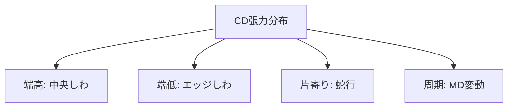

# テンション分布

「張力 100 N/m」と一言で言っても、ウェブ全幅にわたって本当に均一であることは稀である。
**幅方向（CD）に張力分布があると、しわ・蛇行・巻き不良の直接原因** となる。本ページでは張力分布の発生メカニズム、計測法、影響、対策を整理する。

## 1. なぜ張力分布が生じるか

### (a) ウェブ自体の不均一

- 厚さプロファイル（ゲージ）が均一でない。
- 幅方向に物性ムラ（密度、結晶化度、繊維配向）がある。
- 製造履歴で熱収縮分布が異なる（バギング）。

ウェブ自体の長さに **幅方向の差** があると、同じスパンに張った瞬間に伸びの大きい部分は緩み、小さい部分に張力が集中する。

### (b) ロールの不整

- ロール真直度不良（弓状、テーパ）
- ロール表面のクラウンが不適切
- ロール軸のミスアラインメント
- 軸受の摩耗・偏心

### (c) 工程による不均一

- 乾燥炉での温度プロファイル
- 塗工後の溶剤揮発分布
- ニップロールのクラウン・荷重分布

??? question "演習: 張力分布の原因切り分け"
    あるラインで CD 張力分布の片寄りが観測された。原因が「ウェブ自体」「ロールの不整」「工程要因」のどれかを切り分けるには、何を確認すべきか。

    ??? success "解答"
        - **異なる原反ロールでも同じ症状が出るか** → 出れば「ロール／工程要因」、原反ごとに違えば「ウェブ自体」
        - **特定のスパンだけ／全長か** → 特定スパンならそのロール周辺、全長なら原反かライン共通要因
        - **温湿度や乾燥温度を変えて変化するか** → 変化すれば工程要因
        この切り分けがトラブル対応の最初の一手。

## 2. CD 張力分布の数学的表現

幅方向座標を $y$（$-w/2 \le y \le w/2$）とし、CD 方向の張力密度 $t(y) = \sigma(y) h(y)$ を考える。

ウェブが幅方向に変形を許す（座屈しない）と仮定すると、CD 方向の張力分布は局所伸びの分布で決まる：

$$
t(y) = E h \cdot \varepsilon(y)
$$

ここで $\varepsilon(y)$ は局所伸びひずみ。

平均張力は

$$
\bar{t} = \frac{1}{w}\int_{-w/2}^{w/2} t(y) \, dy = \frac{T}{w}
$$

**CD 張力均一性** は次の指標で評価する：

$$
\text{CV}_t = \frac{1}{\bar{t}}\sqrt{\frac{1}{w}\int (t(y) - \bar{t})^2 dy} \times 100\,[\%]
$$

実用目標は CV < 5〜10%、高品質塗工では < 3% が要求されることもある。

??? question "演習: CV値の計算"
    幅 1 m のウェブを CD 5 等分し、各セグメントの単位幅張力を測定したところ、
    $[95, 98, 102, 100, 105]$ N/m を得た。平均 $\bar{t}$ と均一性指標 $CV_t$ [%] を求めよ。

    ??? success "解答"
        平均：$\bar{t} = (95+98+102+100+105)/5 = 100\,N/m$
        標準偏差：$\sqrt{((95-100)^2 + (98-100)^2 + (102-100)^2 + (100-100)^2 + (105-100)^2)/5} = \sqrt{58/5} \approx 3.41$
        $CV_t = 3.41/100 \times 100 = 3.41\%$
        実用目標 5〜10% を満たし、高品質塗工要求の 3% にも近い良好レベル。

## 3. ウェブの直角方向進入性（normal entry rule）

橋本『入門 ウェブハンドリング』第7章、および『ウェブハンドリングの基礎理論と応用』第2章7節「ウエブのトラッキング能力」で定式化されている、ウェブハンドリングの根本原理：

!!! note "ウェブの直角方向進入性（normal entry rule）"
    搬送中のウェブでは、ウェブとローラ間の摩擦力が十分に保持される限り、**下流側ローラの軸に対して直角方向に進入する**。

ロールに進入するウェブの中心線は、ロール軸に対して直角になろうとする。これはモーメント釣り合いから導かれ、後段のロールの傾きが上流のウェブ姿勢に影響を与える。
言い換えると、**ロール真直度が崩れると、その影響は数スパン上流まで伝播する**。

詳細な蛇行解析は [蛇行の発生メカニズム](../steering/mechanism.md) を参照。

??? question "演習: 直角方向進入性"
    下流ロールが片側 0.1 mm/m だけ傾いた状態でウェブが進入している。「ウェブはどう振る舞うか」を答えよ。

    ??? success "解答"
        **ウェブは下流ロール軸に直角方向に進入しようとする**（normal entry rule）。
        その結果、ロール傾きの方向にウェブが幅方向（CD）に移動し、**蛇行が発生**する。
        さらに、ロール手前で CD 圧縮応力が誘起され、超過するとトラフ→折れしわが生じる。

## 4. 張力分布の典型パターン

### (a) 端高 / 端低

ロールのクラウンが大きすぎる／小さすぎることで、ウェブ中央が緩む／張る。
端低（中央集中）はセンタしわの原因。

### (b) 片寄り

ロール軸のミスアラインメントで片側だけ強く張る。
**蛇行**と直結する（片側張力が高い側へウェブが寄る）。

### (c) 周期分布

ロールの偏心、振動、軸受不良で MD 方向に周期的な張力変動が出る。

??? question "演習: 分布パターンから原因推定"
    CD 張力分布が「中央高、両端低」になっている。最も疑うべきロールの状態は？

    ??? success "解答"
        **ロールクラウン過大、またはロール撓み不足**。
        中央が太いクラウンが過剰な状態だと、ウェブ中央部のひずみが大きくなり張力集中。
        対策：クラウン量を下げる、または可変クラウン（Swimming Roll）で運転条件に応じて調整。

## 5. 計測法

### (a) セグメント型ロードセル

ロールを軸方向に分割し、各セグメントの荷重を計測。
最も直接的だが装置が大型化。

### (b) マルチセンサテンションロール

幅方向に複数のテンションピンを配列し、CD 分布を測る。

### (c) 非接触光学法

レーザドップラー振動計でウェブの固有振動数を計測、張力推定。

$$
f_n = \frac{n}{2L}\sqrt{\frac{T}{m'}}
$$

ここで $L$ はスパン長、$m' = \rho h w$ は単位長さ質量、$n$ はモード次数。
**振動弦と同じ原理** で、フリースパンの固有振動数から張力を逆算できる。

### (d) FFT スペクトル解析

ロールの偏心起因の周期成分、ニップ起因の特定周波数などを分離。

??? question "演習: 振動から張力推定"
    スパン長 $L = 2\,m$、PET フィルム（厚さ 25 μm、幅 1 m、密度 1400 kg/m³）の1次固有振動数が $f_1 = 10\,Hz$ と測定された。張力 $T$ [N] を推定せよ。

    ??? success "解答"
        単位長さ質量 $m' = \rho h w = 1400 \times 25 \times 10^{-6} \times 1 = 0.035\,kg/m$
        $f_1 = (1/2L)\sqrt{T/m'}$ より $T = m' (2L f_1)^2 = 0.035 \times (2 \times 2 \times 10)^2 = 0.035 \times 1600 = 56\,N$
        単位幅張力 $t = 56\,N/m$。レーザドップラー等で非接触に張力推定が可能。

## 6. 影響：しわ・蛇行・巻き不良との関係

| 分布タイプ | 発生する現象 |
|------------|--------------|
| 中央高張力 | 中央しわ（センターレーン） |
| 端高張力 | エッジしわ、エッジカール |
| 片寄り | 蛇行、テレスコープ |
| 周期変動 | ゲージバンドの可視化、印刷見当ずれ |
| 平均低過ぎ | ウェブのバタつき、トラッキング不能 |
| 平均高過ぎ | クリープ、永久変形、破断 |

しわの発生は **Timoshenko の薄板座屈理論** で定量化できる：

$$
\sigma_{cr} = -\frac{\pi^2 E}{12(1-\nu^2)}\left(\frac{h}{b}\right)^2
$$

ここで $b$ は座屈半波長。
**圧縮応力**がこの臨界応力を超えると面外座屈（しわ）が発生する。CD 張力分布の凹凸が局所圧縮を作るのが発生原因。

??? question "演習: しわ発生条件"
    PET（$E = 4\,GPa$、$\nu = 0.4$、$h = 25\,\mu m$）、座屈半波長 $b = 20\,mm$ のときの座屈臨界応力 $\sigma_{cr}$ [MPa] を求めよ。

    ??? success "解答"
        $\sigma_{cr} = -\frac{\pi^2 \times 4 \times 10^9}{12(1-0.4^2)}\left(\frac{25 \times 10^{-6}}{0.02}\right)^2$
        $= -\frac{39.5 \times 10^9}{12 \times 0.84} \times (1.25 \times 10^{-3})^2$
        $= -3.92 \times 10^9 \times 1.56 \times 10^{-6} = -6.12 \times 10^3\,Pa \approx -6\,kPa$
        極めて小さな圧縮応力でしわが発生することがわかる。ウェブが座屈に弱い理由。

## 7. 対策

### (a) スプレッダロール

- バナナロール（ボウドロール）：軸が湾曲した受動ロール。CD 外向きに張力を再分配。
- 溝付きロール：摩擦を保ちつつ CD 拡張効果。
- エキスパンダロール（拡張ロール）：軸方向に伸びるゴム筒。

### (b) ロールクラウン設計

ロール撓みを補正するため、中央がわずかに太い「クラウン」を付与。
ニップロールでは荷重・温度・速度で最適クラウン量が変わる。

### (c) ロール平行度・真直度管理

- 真直度：0.01 mm/m オーダーが理想
- 平行度：両端で 0.05 mm 以下
- 定期的なレベル測定と再調整

### (d) ライン全体での張力プロファイル設計

塗工部の低張力、乾燥炉の中張力、巻取部のテーパ張力をライン全体で最適化。

??? question "演習: 対策の優先順位"
    CD 張力分布の片寄りが観測された場合、最初に取るべき対策は次のうちどれか。
    (a) スプレッダロールを追加  (b) ロール平行度を再測定／調整  (c) クラウン量を変更  (d) 張力を上げる

    ??? success "解答"
        **(b) ロール平行度を再測定／調整**。
        片寄りはほぼロールのミスアラインメントが主因。レーザアライナで真直度・平行度を測定し、0.05 mm/m 以下に再調整。
        スプレッダ（a）やクラウン（c）は均一性そのものは改善するが、根本原因対処にならない。

## 参考文献

- 橋本 巨『入門 ウェブハンドリング』第6章「ウェブの張力制御」、第7章「ローラによるウェブの分離・蛇行メカニズム」, 加工技術研究会, 2010.
- 橋本 巨『ウェブハンドリングの基礎理論と応用』第2章7節「ウエブのトラッキング能力」、第6章「ウェブ搬送中に生じるしわの予測」, 加工技術研究会.
- J. J. Shelton, "Lateral Dynamics of a Moving Web", PhD thesis, Oklahoma State Univ., 1968.
- D. R. Roisum, *The Mechanics of Web Handling*, TAPPI Press, 1996, Ch. 5.
- Timoshenko, Gere, *Theory of Elastic Stability*, McGraw-Hill, 1961.
