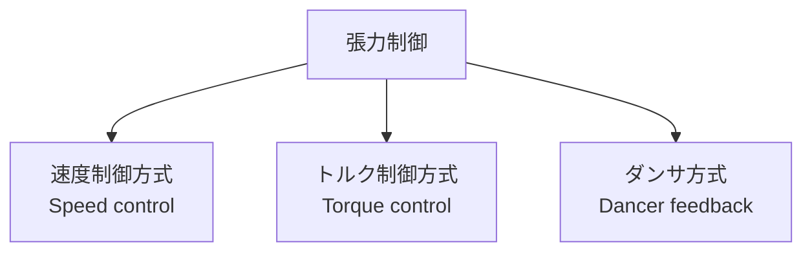

# テンション制御の基本理論

ウェブハンドリングにおける最重要量は **張力（テンション）** である。
張力が不適切だと、しわ・蛇行・破断・巻き不良などほぼ全てのトラブルが発生する。本ページでは張力の物理的意味、基礎方程式、制御の考え方を整理する。

## 1. 張力の定義と単位

### 全幅張力 T

ウェブを横方向に横切る面に作用する引張力の合計を **全幅張力** $T$ という。

$$
T = \int_{0}^{w} \sigma(y)\, h(y)\, dy
$$

ここで $\sigma(y)$ は応力分布、$h(y)$ は厚さ分布、$w$ はウェブ幅。

実用上は分布を無視して

$$
T = \sigma \cdot w \cdot h
$$

とおく。単位は **N**。

### 単位幅張力 t

幅で正規化した量

$$
t = \frac{T}{w} \quad [\text{N/m}]
$$

を **単位幅張力**（線張力）と呼ぶ。材料・厚さ依存の管理値として最もよく使われる。
たとえば「PET 12 μm を 100 N/m で搬送」という言い方をする。

### 張力応力 σ

材料応力としては

$$
\sigma = \frac{T}{w h} = \frac{t}{h} \quad [\text{Pa}]
$$

材料の降伏応力・破断応力との比較は、必ずこの $\sigma$ で行う。

??? question "演習: 単位幅張力と応力"
    PET フィルム（厚さ $h = 25\,\mu m$、幅 $w = 0.5\,m$）を $T = 50\,N$ で搬送している。
    (a) 単位幅張力 $t$ [N/m] を求めよ。
    (b) 応力 $\sigma$ [MPa] を求めよ。

    ??? success "解答"
        (a) $t = T/w = 50/0.5 = 100\,N/m$
        (b) $\sigma = T/(wh) = 50/(0.5 \times 25 \times 10^{-6}) = 4 \times 10^6\,Pa = 4\,MPa$
        単位幅張力 100 N/m を扱うことは多いが、応力は薄物ほど大きくなる点に注意。

## 2. ウェブの応力 - ひずみ関係

線形弾性域では Hooke の法則が成立し、

$$
\sigma = E \cdot \varepsilon
$$

ここで $E$ はヤング率、$\varepsilon = \Delta L / L$ は伸びひずみ。
したがってあるスパンの張力は、入口と出口の速度差に対応するひずみで決まる：

$$
\varepsilon = \frac{V_\text{out} - V_\text{in}}{V_\text{in}}, \qquad T = E w h \, \varepsilon
$$

つまり **隣接ロールの回転速度差が、そのスパンの張力を作る**。これがウェブハンドリング制御の最重要原理。

??? question "演習: 速度差と張力"
    長さ $L = 2\,m$、$E = 4\,GPa$、$h = 25\,\mu m$、$w = 1\,m$ のスパンで、入口と出口のロール速度差が $0.1\%$ のとき、定常状態の張力 $T$ は何 N か。

    ??? success "解答"
        ひずみ $\varepsilon = 0.001$
        $T = E w h \varepsilon = 4 \times 10^9 \times 1 \times 25 \times 10^{-6} \times 0.001 = 100\,N$
        わずか 0.1% の速度差で大きな張力が生まれる ⇒ 高精度な速度制御が必須。

## 3. スパンの張力支配方程式

長さ $L$ のスパンの張力 $T$ は、入口・出口の速度差で時間発展する。
ウェブ密度を無視し、線形弾性とすると、質量保存と Hooke 則から、

$$
\frac{L}{E h w} \frac{dT}{dt} = (V_\text{out} - V_\text{in}) - \frac{T - T_0}{E h w} V_\text{in}
$$

実用形では時定数 $\tau = L / V$ を用いて、

$$
\tau \frac{dT}{dt} + T = T_\text{in} + E h w \cdot \frac{V_\text{out} - V_\text{in}}{V_\text{in}}
$$

ポイント：

- スパンが長いほど時定数大、応答遅い。
- 速度差は **微小な %オーダー** で十分。0.1% でも数十 N/m の張力差を生む。
- 入口張力 $T_\text{in}$ が前段から伝播してくる（スパン同士は結合）。

??? question "演習: スパン時定数"
    スパン長 $L = 2\,m$、搬送速度 $V = 100\,m/min$ のスパンの時定数 $\tau$ [s] を求めよ。

    ??? success "解答"
        $V = 100/60 \approx 1.67\,m/s$
        $\tau = L/V = 2/1.67 \approx 1.2\,s$
        この時定数より速い制御指令を入れても張力応答は追いつかない。逆に時定数より十分遅い制御なら安定。

## 4. PI / PID 制御と最終値の定理

橋本『ウェブハンドリングの基礎理論と応用』第8章では、張力制御系のフィードバックを伝達関数で記述し、最終値の定理から各制御則の特性を導出している。要点：

| 制御則 | 伝達関数 $G_c(s)$ | ステップ入力時のオフセット $e(t\to\infty)$ |
|--------|-------------------|-------------------------------------------|
| P（比例のみ） | $K_p$ | $1/(1+K_pK)$ — **オフセット残存** |
| PI | $K_p + K_i/s$ | $0$ — オフセット消滅 |
| PID | $K_p + K_i/s + K_d s$ | $0$ — さらに応答改善・オーバーシュート低減 |

これより、張力制御で **P 単独はオフセットが残るため不適**、PI または PID を使うべき、という結論が同書 図8-10 のステップ応答シミュレーションで実証されている。

ゲイン特性（同書第8章 表現）：

- **比例ゲイン $K_p$**：大きいほどオフセット減・応答振動周期短。過大で系不安定。
- **積分ゲイン $K_i$**：大きいほどオフセット消滅・回復速い。過大で系不安定。
- **微分ゲイン $K_d$**：大きいほど安定性向上・振動周期短。ノイズに敏感。

??? question "演習: 制御則の選択"
    張力指令 100 N/m に対し、定常状態で実張力が 95 N/m となり、5% のオフセットが永続している。
    現在の制御は P 制御のみ。改善するにはどうすべきか。

    ??? success "解答"
        **PI または PID 制御に変更**する。橋本『基礎理論と応用』第8章の最終値の定理から、
        - P 制御：$e(\infty) = 1/(1+K_pK) > 0$（オフセット残存）
        - PI 制御：$e(\infty) = 0$（オフセット消滅）
        積分項を加えることでオフセットがゼロに収束する。

## 5. 張力制御の三方式

### (a) 速度制御方式

ドライブロールの周速度を制御し、隣接ロールとの速度差で張力を作る。

- 主にロードセル（テンションセンサ）で実張力を計測 → PID で速度補正。
- 高精度。塗工・印刷の中間搬送で標準的。
- スパン剛性 $E w h / L$ が低いと制御ゲインが取りづらい。

### (b) トルク制御方式

巻出／巻取の中心モータに直接トルクを与え、巻径と張力からトルク指令を計算する。

$$
\tau = T \cdot R + J \frac{d\omega}{dt} + B \omega
$$

- $R$：巻取径、$J$：慣性、$B$：摩擦
- 巻径 $R$ の推定（または計測）が必須。
- 巻出・巻取で多用。

### (c) ダンサ方式

スパン中にダンサロールを設け、バネ／空圧シリンダで一定荷重を加える。ダンサ位置を一定に保つようドライブ速度を制御。

- 機械的に張力変動を平滑化できる。応答の悪い系で有効。
- 構造が大きく、慣性も増える。

実機ではこれらを組み合わせる：

| ゾーン | 標準的方式 |
|--------|-----------|
| 巻出 | トルク + ロードセルFB |
| 中間搬送 | 速度制御（マスタ＋スレーブ） |
| 塗工部前後 | ダンサ + 速度制御 |
| 巻取 | トルク + テーパテンション |

??? question "演習: 制御方式の選択"
    高速の塗工部直前で「張力変動が大きく、塗工厚みが乱れる」現象が起きている。最適な制御方式は次のうちどれか。
    (a) 速度制御方式  (b) トルク制御方式  (c) ダンサ方式

    ??? success "解答"
        **(c) ダンサ方式**。
        ダンサロールは機械的に張力変動を平滑化（低域フィルタ）する効果があり、塗工部のように張力変動を最小化したい工程で標準的に使われる。
        (a) 速度制御は精度高いが平滑化効果はなし、(b) トルク制御は巻出・巻取向き。

## 6. テンションゾーンの考え方

ライン全体は **テンションゾーン** に分割され、各ゾーン内では張力が一定（理論上）。ゾーンを分けるのは**完全に駆動を分離する装置**：

- ニップロール（高い駆動分離度）
- Sラップ駆動ロール（駆動分離度中）
- 真空サクションロール

各ゾーンで独立に張力を設定できるため、

- 塗工部はスジを出さない低張力
- 乾燥炉内は熱収縮対応の張力
- 巻取部はテーパテンション

といった工程ごとの最適化が可能になる。

??? question "演習: ゾーン設計の目的"
    なぜラインを複数のテンションゾーンに分けるのか。1行で答えよ。

    ??? success "解答"
        **各工程に最適な張力を独立に設定するため**。
        塗工部は低張力、乾燥部は熱収縮対応の張力、巻取部はテーパテンションなど、工程ごとの要求が異なる。
        ニップロール等で駆動分離して初めて、それぞれを独立制御できる。

## 7. 張力の基本方程式（速度ベース）

実機解析でしばしば使われる連立式（Shelton 1968 起源）：

$$
\frac{dT_i}{dt} = \frac{E w h}{L_i}\left( V_i - V_{i-1} \right) - \frac{V_i}{L_i}(T_i - T_{i-1})
$$

ここで $T_i, V_i, L_i$ は $i$ 番目のゾーンの張力・出口速度・スパン長。
$T_{i-1}$ は前ゾーンからの「持ち込み張力」を表す。

この式が示す重要事実：

1. 張力は速度差で生成される。
2. 上流張力は **そのまま下流に伝播** する（駆動分離が不完全な場合）。
3. ライン全体の張力制御は連立微分方程式系として設計する。

ロール上での張力ジャンプ機構については [オイラーの摩擦式](euler.md)、空間的な張力分布については [テンション分布](distribution.md)、実機ハードウェアの選定は [制御機器の選定](devices.md) を参照。

??? question "演習: 上流張力の伝播"
    Shelton 方程式から、駆動分離が不完全な場合に上流の張力変動が下流に与える影響を簡潔に説明せよ。

    ??? success "解答"
        Shelton 方程式の右辺第2項 $V_i (T_i - T_{i-1})/L_i$ から、$T_{i-1}$（上流張力）の変化は **直接** 当該ゾーンの張力時間変化に影響を与える。
        つまり、駆動分離が不完全だと上流の張力変動が次々と下流へ伝播していき、ライン全体で振動的になる。
        ニップロールなどで完全分離すれば、$T_{i-1}$ の影響は遮断され、ゾーンごとの独立制御が可能。

## 参考文献

- 橋本 巨『入門 ウェブハンドリング』第6章「ウェブの張力制御」, 加工技術研究会, 2010.
- 橋本 巨『ウェブハンドリングの基礎理論と応用』第8章「ウェブ搬送・巻取時の張力制御」（特に8.5節「PIDコントローラの基本事項」、8.6節「PID のウェブ張力制御系への適用」）, 加工技術研究会.
- K. N. Reid, K. C. Lin, "Dynamic Behavior of Dancer Subsystems in Web Transport Systems", *Web Handling Conference*, 1993.
- G. E. Young, K. N. Reid, "Lateral and Longitudinal Dynamic Behavior and Control of Moving Webs", *ASME Journal of Dynamic Systems*, 1993.
