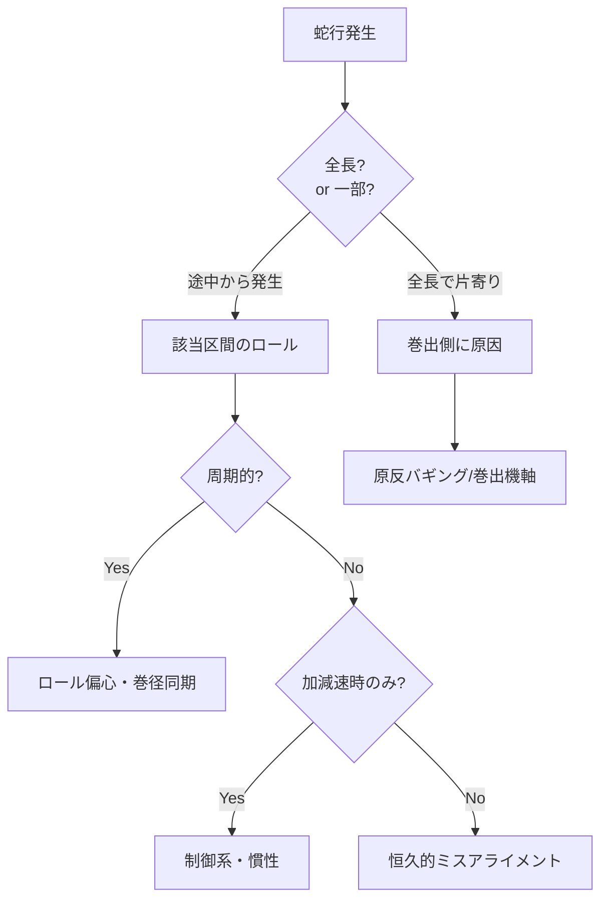

# 蛇行トラブルの対策

蛇行（ウェブの幅方向位置ずれ）は、印刷見当ずれ、巻取端面の不揃い、塗工幅変動、エッジ折れ、テレスコープなど多くの不具合を直接引き起こす。
本ページでは蛇行トラブルの実用的な切り分け手順、対策、再発防止のチェックポイントをまとめる。

発生メカニズムや EPC 装置については [蛇行の発生メカニズム](../steering/mechanism.md)、[自動蛇行修正装置](../steering/auto-guide.md) を参照。

## 1. 蛇行トラブルの分類

| 種類 | 症状 | 主原因 |
|------|------|--------|
| 定常蛇行（DC ずれ） | 常に同じ方向にオフセット | ロール恒久ミスアライメント、ウェブの片伸び |
| ドリフト型 | 時間とともにゆっくり片寄る | 温度変化、軸受摩耗、ロール撓み変動 |
| 周期蛇行 | ロール周期、巻出周期に同期 | ロール偏心、原反バギング |
| 振動的蛇行 | 周期 0.5〜5 Hz で揺れる | EPC ゲイン過大、機械共振 |
| 過渡的蛇行 | スプライス・加減速時のみ | 慣性、張力急変 |
| ランダム蛇行 | 不規則 | 環境変動、空気同伴、外乱 |

??? question "演習: 蛇行分類"
    次の症状はどの分類の蛇行か。
    (a) 季節が変わってから片寄り傾向が出始めた
    (b) スプライス通過時のみ瞬時に大きく振れる
    (c) 巻出 1 周期に同期して左右に振れる

    ??? success "解答"
        (a) **ドリフト型**（温度変化、軸受摩耗、ロール撓み変動など）
        (b) **過渡的蛇行**（慣性、張力急変。アキュムレータと制御ホールドで対応）
        (c) **周期蛇行（巻出周期同期）**（原反バギング、巻出機軸偏心）

## 2. 蛇行発生時の即時対応

### 緊急停止判断

蛇行量がウェブ幅の数% を超えると、ロール端面で擦れ・破断・テレスコープの危険。
非常停止 or 減速して状況を観察するのが安全。

### データ収集

トラブル発生時は **記録を優先**：

- ライン速度、張力、各ゾーン設定値
- EPC 偏差量、ガイドロール角度
- 環境条件（温湿度）
- 直前の変更点（材料、ロール交換、設定変更）
- 発生位置の写真／動画

??? question "演習: 緊急時判断"
    ウェブ幅 1000 mm のラインで、蛇行量が 30 mm に達した。次にとるべき行動は？

    ??? success "解答"
        **減速 or 非常停止**。
        蛇行量がウェブ幅の 3% に達しており、ロール端面で擦れ・破断・テレスコープのリスクが高い。
        まず停止して状況を観察し、原因切り分けに進む。
        強引に運転継続すると製品全数廃棄、装置損傷につながる。

## 3. 切り分けフロー

### Step 1: 発生位置の特定

蛇行は通常、**下流ロールの傾きが上流のウェブ姿勢に現れる** ことに注意（[直角方向進入性](../steering/mechanism.md)）。
原因のロールは、観察された位置より **下流側** にもあり得る。

### Step 2: 周期性の確認

- センサ波形を FFT
- ロール回転周波数 $f_r = V/(\pi D)$ と照合
- 巻出・巻取の回転周期との同期性
- 周期成分が見えれば、該当ロール／原反を疑う

### Step 3: 温度・湿度の確認

- 工場入口、ライン上、乾燥炉前後の温湿度
- 季節変動による特定の時期だけ発生する蛇行は環境要因

### Step 4: 機械点検

- ロール平行度測定（レーザアライナ）
- ロール真直度・撓み
- 軸受異音・温度
- フレーム水平度

??? question "演習: 切り分けの第一歩"
    蛇行発生時、最初に「全長で片寄り」か「途中から発生」かを判別する理由は？

    ??? success "解答"
        **原因の絞り込みに直結するから**。
        - 全長で片寄り → 巻出側（原反バギング、巻出機軸ズレ）が支配的
        - 途中から発生 → ライン中の特定ロール／工程が原因
        この切り分けで点検対象を 1/3 程度に絞れる。

## 4. 原因別の対策

### (a) ロールミスアライメント

**最頻原因**。次の手順で点検：

1. 上流から順にロール軸の水平／垂直角度をレーザで測定
2. 基準ロール（ニップやアキュムレータの定置ロール）に対する相対角度
3. 平行度目標：0.05 mm/m 以下
4. 必要なら再アライメント＋固定金具増締め

ロールが熱変形する場合（乾燥炉内ロール、加熱ロール）は、運転温度での平行度を確認。

### (b) ロール撓み

- 設計撓みを超える張力で運転していないか
- ロール径アップ、肉厚アップ、材質変更
- クラウン補正

### (c) 偏心・打痕

- ロール表面を低速回転させ、ダイヤルゲージで振れ測定
- 振れ 10 μm 以下が目安
- 振れ大の場合は研磨／交換
- 軸受は P5 以上の精度クラスへ

### (d) 原反バギング

- ロール表面に明らかな波打ち、たわみが見える場合バギング
- 受入検査強化、サプライヤ品質改善
- スプレッダロール導入で部分緩和

### (e) 制御系の問題

- EPC ゲイン下げて発振解消
- ループ周期短縮
- センサノイズフィルタ
- 速度依存ゲインスケジューリング

### (f) スプライス通過時

- 接紙部の段差最小化
- 接紙通過時に EPC 一時ホールド
- アキュムレータでバッファ

??? question "演習: 平行度基準"
    蛇行原因のミスアライメント対策で、ロール平行度の目標値は何 mm/m か。また測定にはどんな機器を使うか。

    ??? success "解答"
        **目標値：0.05 mm/m 以下**。
        測定機器：**レーザアライナ**（レーザ墨出器、レーザトラッカー等）。
        水平・垂直方向ともにレーザ光線を基準として、ロール軸の傾き・平行度・直角度を精密測定する。
        固定金具のガタや経年変形を発見できる。

## 5. 周期蛇行の解析実例

例：周期 0.7 秒の蛇行が観察された。

ライン速度 V = 100 m/min = 1.67 m/s。
0.7 s 周期 → 1 周期で進む距離 = 1.17 m。

該当する周期長を持つロールを探す：

| ロール直径 D | 周期長 $\pi D$ | 該当?|
|-----------|---------------|------|
| 100 mm | 314 mm | 否 |
| 200 mm | 628 mm | 否 |
| 372 mm | 1170 mm | **該当** |

ライン中の直径約 370 mm のロール（例：ライン中央のドライブロール）が候補。
そのロールを点検 → 偏心 0.3 mm 発見 → 旋盤研磨で振れ 10 μm 以下に → 蛇行解消。

??? question "演習: 周期蛇行のロール特定"
    ライン速度 $V = 200\,m/min$、観察された蛇行の周期 $T = 0.5\,s$ のとき、原因となるロール径 $D$ [mm] を推定せよ。

    ??? success "解答"
        $V = 200/60 = 3.33\,m/s$
        1周期で進む距離 $= V \times T = 3.33 \times 0.5 = 1.67\,m$
        この距離が $\pi D$ に等しいロール：$D = 1.67/\pi \approx 0.530\,m = 530\,mm$
        該当する直径 530 mm のロール（偏心・打痕・軸受不良）を点検対象とする。

## 6. 高速ライン特有の蛇行

ライン速度を上げると以下が発生する：

- 空気同伴で実効摩擦低下 → 直角方向進入性が崩れる
- ロール回転速度が固有振動数に近づく → 危険回転数
- 制御系の応答が追いつかない

対策：

- 溝付きロール、真空ロール導入
- 駆動分離の強化（ニップ追加）
- EPC 制御ゲイン再調整、応答速いアクチュエータ採用
- ロールの剛性アップ

??? question "演習: 高速化での蛇行対策"
    ラインを 200 → 400 m/min に増速したところ蛇行が大きくなった。物理メカニズムを答え、対策を 3 つ挙げよ。

    ??? success "解答"
        **メカニズム**：空気同伴の増加（$h_\text{air} \propto V^{2/3}$）で実効摩擦係数が低下し、ウェブの直角方向進入性が崩れた。
        **対策**：
        (1) **マイクログルーブローラ／真空ロール**で空気膜を排除
        (2) **EPC ゲイン・ループ周期の再チューニング**（速度依存ゲインスケジューリング）
        (3) **ニップ追加**で駆動分離強化

## 7. 巻取での蛇行：テレスコープ・スターリング

巻取ロールに蛇行が現れると、軸方向にずれて積み上がり「テレスコープ」となる。
原因と対策：

| 症状 | 原因 | 対策 |
|------|------|------|
| テレスコープ | 巻取直前の蛇行未修正 | 巻取直前 EPC 必須 |
| 端面ガッタリング | エッジ近傍の局所緩み | スプレッダ、テーパ強化 |
| スターリング | CD 張力不均一 | クラウン、ニップ調整 |
| ダイシング | 軸方向力の左右差 | ガイド調整、駆動見直し |

巻取り直前の EPC は必須装備と考える。

??? question "演習: テレスコープ防止"
    巻取ロール直前で蛇行が修正されておらず、テレスコープが発生している。根本的な対策は？

    ??? success "解答"
        **巻取直前に EPC（Edge Position Control）ガイドロールを必ず設置する**。
        どんなに上流で蛇行を吸収していても、その後のスパンで蛇行が再発するため、巻取直前のシフト補正は必須装備。
        補助的に、原反由来の蛇行を巻出直後 EPC で吸収しておくとさらに安定する。

## 8. 再発防止：データの蓄積

蛇行トラブルは類似事例が多い。組織として：

- トラブル日誌（症状、原因、対策、効果）を残す
- 各ロールの平行度・振れ測定値の履歴
- 製品 / 材料別の典型蛇行パターン
- メンテ周期の見直し

これらは IoT センサと PLC ロギングを組み合わせると効率化できる。

??? question "演習: ナレッジ蓄積の意義"
    蛇行トラブル対応で「トラブル日誌」を残すべき理由を 2 つ挙げよ。

    ??? success "解答"
        (1) **類似事例の高速解決**：過去の症状・原因・対策パターンを参照することで、新規トラブル発生時に切り分けと対策の時間を大幅短縮できる。
        (2) **再発防止のメンテ周期最適化**：頻発するロールや工程を統計的に把握し、予防保全周期や部品交換タイミングを科学的に決められる。
        IoT センサ＋PLC ロギングで自動化すれば、組織知の蓄積が加速する。

## 9. 蛇行トラブル対策チェックリスト

### 即時対応

- [ ] 蛇行量、頻度、周期を記録
- [ ] FFT 解析で支配周波数を抽出
- [ ] 直前の変更点（材料、ロール、設定）確認
- [ ] EPC センサ・アクチュエータ動作確認

### 短期対策

- [ ] 該当ロール平行度の再測定・修正
- [ ] EPC ゲインの再調整
- [ ] スプレッダロール導入検討
- [ ] 原反受入条件の確認

### 中長期対策

- [ ] ロール構成の見直し（駆動分離追加、スパン短縮）
- [ ] ロール材質・剛性アップ
- [ ] 環境制御（温湿度、振動）
- [ ] メンテ周期の最適化
- [ ] サプライヤ品質改善依頼

## 参考文献

- 橋本 巨『入門 ウェブハンドリング』第7章「ローラによるウェブの分離・蛇行メカニズム」, 加工技術研究会, 2010.
- 橋本 巨『ウェブハンドリングの基礎理論と応用』第2章7節「ウェブのトラッキング能力」.
- 『スリッター・リワインダーの技術読本』第1章 3.2「回転ローラー（出側・入側ローラー、テーパーローラー）」.
- D. R. Roisum, *The Mechanics of Web Handling*, TAPPI Press, 1996, Ch. 4.
- 各メーカ EPC 装置取扱説明書（Maxcess, Erhardt+Leimer, Nireco 等）.
