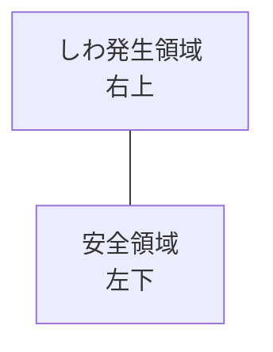
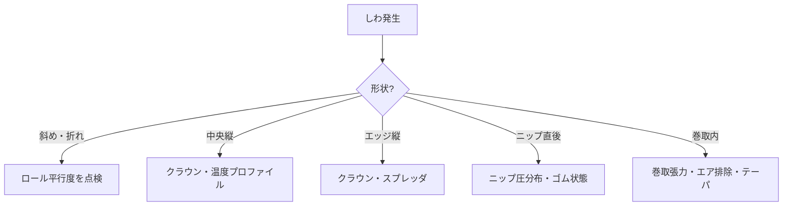

# しわの原因と対策

しわ（wrinkle）はウェブハンドリングで最も発生頻度が高く、最も嫌われるトラブル。
本ページではしわの分類、発生メカニズム、原因切り分け、対策を体系的に整理する。

## 1. しわの分類

しわは発生位置・形状・発生時期で分類される。

| 分類 | 形状・特徴 | 主原因 |
|------|-----------|--------|
| 折れしわ（fold wrinkle） | 鋭く折れ込んで永久痕が残る | ロールミスアライメント、過張力 |
| センタしわ | ウェブ中央に縦方向の波 | 端高張力、中央緩み |
| エッジしわ | 両端付近に縦方向の波 | 端低張力、エッジ収縮 |
| 斜めしわ | 斜め方向に走る | ロール傾き、片寄り |
| ニップしわ | ニップ通過時に発生 | クラウン不適、ニップ圧過大 |
| 巻取しわ（ガッタリング） | 巻取ロール内に現れる | 巻取張力過大、エア排除不良 |
| ベイギング | 横方向にゆるみが残る | 製造時の不均一伸び |

## 2. しわの物理：座屈現象

しわはウェブの **面外座屈** 現象である。
Timoshenko の薄板座屈理論によれば、CD方向の圧縮応力 $\sigma_y$ が以下の臨界値を超えると座屈が起こる：

$$
\sigma_{y, cr} = -\frac{\pi^2 E}{12(1-\nu^2)} \left(\frac{h}{b}\right)^2
$$

ここで $h$ はウェブ厚さ、$b$ はしわの半波長、$E$、$\nu$ は材料物性。
ウェブは極めて薄いため、わずかな CD 圧縮応力ですぐに座屈する。

**重要**：しわはウェブが「圧縮されたから」できる。引張られているとしわは出ない。
すなわち **どこに局所圧縮が生まれているか** を考えるのがしわ対策の原点。

## 3. 折れしわのメカニズム（橋本理論）

橋本『ウェブハンドリングの基礎理論と応用』第6章では、ロールミスアライメントに起因する折れしわが詳細に解析されている。

### 発生プロセス

ロールが傾くと、ウェブはローラの直角方向に進入しようとする（[ウェブの直角方向進入性](../steering/mechanism.md)）。
その結果、ウェブ内に **斜め方向の引張＋ CD圧縮** が誘起される。CD圧縮が臨界値を超えると、

1. **波板状くぼみ（trough）** が発生（ロール手前で観察される斜めの波）
2. ミスアライメントが進むと、それが **折れ込む** → 折れしわ

### 臨界ミスアライメント角度

橋本らの実験では、しわ発生限界が **ウェブ張力 vs ミスアライメント角度** 平面で「L字状」の境界線を描くことが示されている。

- 限界線①：張力依存性弱（低張力側）
- 限界線②：張力依存性強（高張力側）、速度の影響あり

低速・高摩擦条件と、高速・空気同伴大の条件で限界線②は大きく異なる。
ライン速度を上げると、同じ張力・同じミスアライメントでもしわが出やすくなる。

### 対策の方向性

- **ミスアライメントを減らす**：ロール平行度・真直度の管理
- **張力を最適化**：高すぎても低すぎても危険。L字の谷で運用
- **巻き付き角を増やす**：ウェブの直進性を強化
- **摩擦を上げる**：溝付きロール、粗面化で空気膜を破る

詳細な実験データは橋本『基礎理論と応用』第6章 図6-8〜6-10 を参照。

## 4. その他主要しわの原因

### センタしわ

- ロールクラウン過大 → 中央が高く、CD両端より圧縮される
- 乾燥工程で中央が早く収縮
- 塗工厚みの中央集中

対策：

- クラウン低減、可変クラウン
- 加熱プロファイル平準化
- 塗工幅・厚み分布の改善

### エッジしわ

- ロールクラウン不足、または逆クラウン
- ウェブ両端の局所的物性ムラ
- 巻取で両端からエア排出
- TDテンター後のエッジ伸び

対策：

- 適切なクラウン量
- スプレッダロール（バナナロール、スパイラル溝）
- エッジトリミング

### 斜めしわ

- ロール片側のミスアライメント
- 片側張力過大
- 駆動ロールの偏摩耗

対策：

- ロール平行度再調整
- 左右独立テンションセンサで張力分布計測
- 駆動ロール表面研磨／再被覆

### ニップしわ

- ニップ圧の CD分布不均一（クラウン不適、撓み）
- ニップ進入時のエア同伴
- ゴムロール表面の偏摩耗、変形

対策：

- 可変クラウン（Swimming Roll）
- 適切なゴム硬度
- 加圧シリンダの左右独立調整

## 5. しわの原因切り分けフロー

## 6. 診断のチェック手順

しわ発生時に現場で行うべき確認：

1. **発生位置を特定**：ライン全長のどこか？ どのロール上／後か？
2. **形状を観察**：縦／横／斜め／折れ
3. **発生タイミング**：定常／加減速／ロール交換後／温湿度変動時
4. **頻度**：常時／間欠／周期的
5. **直前の変更点**：材料、ロール、設定値、外気
6. **左右差**：片側のみか、両側か
7. **巻径依存**：巻出が進むにつれて出る／消える

これらを総合して原因仮説を立てる。

## 7. しわ防止の設計指針

### 装置設計

- ロール平行度：0.05 mm/m 以下
- ロール真直度：0.01 mm/m 以下
- スパン長：必要以上に長くしない（ベイギング助長）
- 巻き付き角：90°以上を確保
- 駆動分離度：必要なゾーン分離
- スプレッダロール：適所配置

### 運転条件

- 張力：[材料別目安](../basics/material-film.md)に従って最適化
- 速度：高速化はしわリスク増、段階的に
- 加減速：穏やか（張力ピーク抑制）
- 環境：温湿度安定化

### 材料選定

- 厚さムラ（ゲージプロファイル）の小さい原反
- 残留応力の少ない原反
- 適切な摩擦係数（高すぎ・低すぎいずれも難）

## 8. 巻取しわの特殊性

巻取りロール内部で発生するしわは「巻取しわ」と呼ばれ、特殊な対策が必要：

- **エア同伴対策**：ライダロール、ニップ巻取
- **テーパテンション**：巻径増で張力減
- **TNT 設計**：張力・ニップ・トルクの統合最適化
- **ゲージプロファイル管理**：原反厚さ均一化
- **オシレーション（オシレートワインダ）**：軸方向に巻き位置を微振動

詳細は橋本『基礎理論と応用』第9章「拡張理論」、特に9.5節「空気巻き込みを考慮したウエブ巻取理論」を参照。

## 理解度チェック

??? question "演習1: しわの本質"
    「ウェブにしわが発生する」のは物理的に何が起こっているのか、一言で答えよ。

    ??? success "解答"
        **CD（幅方向）の圧縮応力が、ウェブの薄板座屈臨界値を超えたとき**に、面外座屈（しわ）が発生する。
        引張だけならしわは出ない。「どこに局所圧縮が生まれているか」を考えるのが対策の出発点。

??? question "演習2: しわパターンの切り分け"
    ライン全長で「斜めに走る折れしわ」が観察された。最も疑うべき原因は？

    ??? success "解答"
        **ロールミスアライメント（平行度不良）**。
        斜めしわはロール片側の傾き → ウェブの直角方向進入性の崩れ → トラフ → 折れしわ の典型的連鎖。
        対策：レーザアライナでロール平行度を 0.05 mm/m 以下に再調整。

??? question "演習3: 巻取しわ"
    巻取ロール内で「中央付近に星形のしわ（スターディフェクト）」が観察される。原因と対策を答えよ。

    ??? success "解答"
        **原因**：
        - 巻取ロール内部の **円周方向応力が圧縮**（マイナス）になっている
        - 内層側で半径方向応力が過剰、または CD 張力分布の不均一

        **対策**：
        (1) 巻取初期の張力を下げる
        (2) コアを変形しにくい材質（FRP等）に変更
        (3) テーパテンション制御で巻径増ごとに張力を下げる
        (4) 「ウェブマスター」等のシミュレータで応力分布を解析し最適化

## 参考文献

- 橋本 巨『ウェブハンドリングの基礎理論と応用』第6章「ウェブ搬送中に生じるしわの予測」, 加工技術研究会.
- 橋本 巨『入門 ウェブハンドリング』第3章, 第5章, 加工技術研究会, 2010.
- Timoshenko, Gere, *Theory of Elastic Stability*, McGraw-Hill, 1961.
- J. K. Good, "A Review of Web Wrinkling Research", *International Web Handling Conference*.
- D. R. Roisum, *The Mechanics of Web Handling*, TAPPI Press, 1996, Ch. 6.
